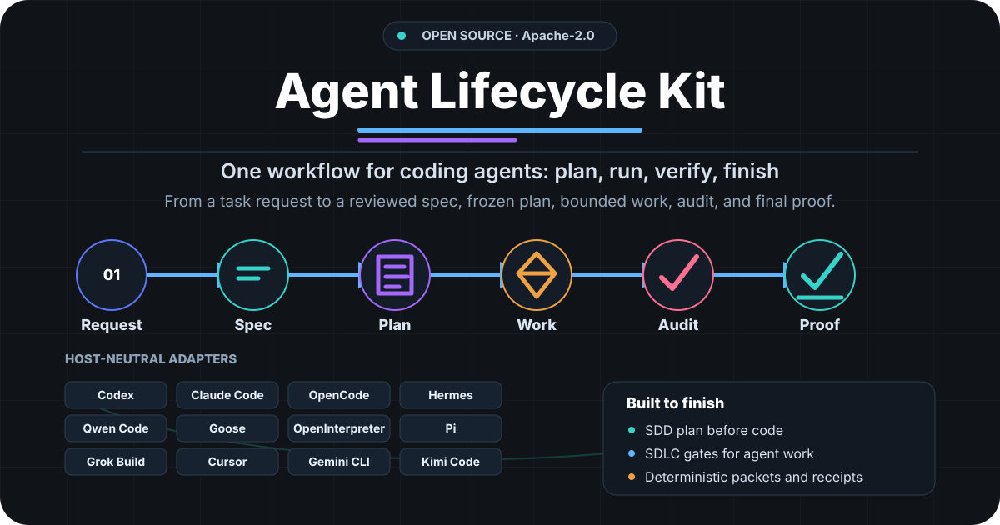

<p align="center">
  
</p>

# Agent Lifecycle Kit

[](LICENSE)
[](https://github.com/avksp/agent-lifecycle-kit/releases)


**Agent Lifecycle Kit (ALK)** is a provider-neutral control layer for coding
agents. It turns a user task into a reviewed spec, frozen plan, bounded work,
implementation review, and final proof, so agents finish the job instead of
stopping at a patch.

Use it when you want Codex, Claude Code, Qwen Code, Goose, OpenInterpreter, Pi,
Grok Build, or another CLI to follow the same quality loop without putting
provider, model, or secret policy into the core.

## Quick start

From a source checkout:

```bash
python -m pip install -e .
agent-lifecycle version
agent-lifecycle diagnose --no-install-plans
agent-lifecycle adapter validate --descriptor adapters/codex/adapter.descriptor.json
```

For a short walkthrough, use [Quickstart](docs/guides/quickstart.md). The
Russian documentation starts at [Документация на русском](docs/ru/README.md).

## Why try it

- Finish-oriented lifecycle: plan, execute, review, and prove the result.
- Provider-neutral adapters: host-specific commands stay outside the core.
- Small-model friendly packets: compact context, clear next actions, and
  deterministic checks for local or cheaper models.
- Quality without overengineering: optional profiles turn on only when risk or
  task type requires them.
- Usage visibility: token/resource accounting is native; USD cost is optional
  and only used when a metered host reports it.

## Feature areas

### Plan and execute

- Reviewed specification and plan flow before implementation starts.
- Deterministic task packets for splitting work across agents.
- Fail-closed execution receipts, completion gates, blockers, retries, and
  final proof.
- Draft-only task templates for bugfix, idea-to-PR, PR review, merge-conflict
  repair, and release-readiness work.

### Quality and proof

- Implementation audits compare results with the frozen plan and acceptance
  evidence.
- Optional Bug Forensics profile for explicit bug/regression repair:
  reproduction, fingerprint, failure class, hypothesis ledger, minimal patch,
  proof, and reusable recipes.
- Optional proof-integrity evidence for high-risk final proofs: stable findings,
  root-cause digests, fix-impact receipts, and hash chains.
- Optional cross-check, runtime policy, and write-back receipts stay off by
  default and become blocking only when the plan says so.

### Routing and cost control

- Compact context profiles, small-model packets, objective snapshots, and
  local quality-cost learning help choose the lightest safe mode.
- Phase resource measurements reuse the usage export envelope for tokens,
  duration, and resource counters without mandatory USD-cost accounting.
- Usage/session exports include tokens, resources, receipt digests, and optional
  host-reported `cost_usd`.

### Adapters and interop

- Adapter contracts keep host-specific projections separate from lifecycle
  schemas.
- Release-time adapter capability bench tools build bounded probe plans and
  validate live-receipt drift without automatic maturity changes.
- Import mappers and issue-to-spec intake treat external workflows, agent
  dialects, and tickets as untrusted draft inputs.
- Lightweight episode retrieval over receipt/session summaries keeps digest
  provenance and explicit `chainVerified` or `chainUnchecked` state.

### Operations

- Runner recovery receipts cover attempt snapshot, restore, abandon, selected
  attempt, worker lease, and heartbeat state.
- Optional sandbox boundary receipts record runtime containment separately from
  git write scope.
- Read-only diagnostics, event feeds, and progress views inspect checkout and
  workflow state without model calls.

## Daily flow

Spec -> frozen plan -> bounded work -> implementation audit -> final proof.
Core commands cover specification, plan, workflow, audit, adapters, imports,
metrics, policy, diagnostics, and runner state. See [CLI reference](docs/reference/cli.md)
and [Source of truth](docs/reference/source-of-truth.md).

## Adapter maturity

`EXPERIMENTAL` means the adapter has source projection metadata and deterministic
offline checks, but it is not promoted. `VERIFIED` is host-specific and requires
bounded live host conformance, usage/resource calibration, accepted redacted
evidence, and lifecycle final proof for the tested host range. USD accounting is
required only for metered modes.

| Host | Current claim |
| --- | --- |
| Codex | `VERIFIED` for Codex CLI 0.145.0. Public Plugins Directory approval is not claimed. |
| Claude Code | `VERIFIED` for Claude Code 2.1.220. Official directory approval is not claimed. |
| OpenCode | `VERIFIED` for OpenCode CLI 1.18.9. npm publication is not claimed. |
| Hermes | `VERIFIED` for Hermes Agent v0.19.0. Public directory approval is not claimed. |
| Qwen Code | `VERIFIED` for Qwen Code 0.21.0 on the tested host-local provider/model binding. Public package approval is not claimed. |
| Cursor | `EXPERIMENTAL`; local safe inspection passed, but accepted live receipts are incomplete. |
| Gemini CLI | `EXPERIMENTAL`; local live canary is blocked by the current Gemini Code Assist tier. |
| Goose | `VERIFIED` for Goose 1.45.0 on the tested host-local provider/model binding. Public directory approval is not claimed. |
| Kimi Code | `EXPERIMENTAL`; live proof requires a configured provider and model alias. |
| Grok Build | `VERIFIED` for Grok Build 0.2.117 on the tested host-local provider/model binding. Public directory approval is not claimed. |
| OpenInterpreter | `VERIFIED` for `interpreter` 0.0.34 on the tested host-local provider/model binding. Public directory approval is not claimed. |
| Pi | `VERIFIED` for Pi 0.83.0 on the tested host-local provider/model binding. Public directory approval is not claimed. |

Adapter installation and maturity details live in
[Adapter install](docs/adapters/install.md) and
[Adapter support matrix](docs/adapters/support-matrix.md).

## Contract map

The public lifecycle surface is schema-backed. Full stable schema ids,
compatibility rules, runner recovery, cross-check, Bug Forensics, and usage
export details are listed in [Public contracts](docs/reference/public-contracts.md).

## Design boundaries

- The core stays provider-neutral. Concrete host commands and model bindings
  belong to adapters or host-local profiles.
- Small models get compact packets, deterministic checks, and explicit
  next-action lists instead of long narrative state.
- Larger models keep the same gates; better reasoning does not bypass evidence.
- A dry run, scaffold, inspection, or synthetic replay cannot promote an adapter.
- Public release claims are limited to tracked source files and redacted
  evidence summaries.
- External dialect imports and retrieved episodes are context aids only; they
  do not replace reviewed ALK source-of-truth artifacts.
- Optional cross-check and runner recovery receipts add evidence only when a
  task or plan requests them; they are not default multi-model execution.

## Documentation

- Start: [English documentation](docs/README.md), [Русская документация](docs/ru/README.md), and [Quickstart](docs/guides/quickstart.md).
- Planning and adapters: [Issue to specification drafts](docs/guides/issue-to-spec.md), [Adapter install](docs/adapters/install.md), and [Adapter support matrix](docs/adapters/support-matrix.md).
- Reference: [CLI reference](docs/reference/cli.md), [Source of truth](docs/reference/source-of-truth.md), [Public contracts](docs/reference/public-contracts.md), and [Readiness diagnostics](docs/reference/readiness-diagnostics.md).
- Quality and cost: [Small-model packets](docs/reference/small-model-packets.md), [model routing](docs/reference/model-routing.md), [adaptive policy](docs/reference/adaptive-lifecycle-policy.md), [quality-cost learning](docs/reference/quality-cost-learning.md), [lifecycle cost accounting](docs/reference/lifecycle-cost.md), [Usage export](docs/reference/usage-export.md), and [Evidence integrity](docs/reference/evidence-integrity.md).
- Profiles and operations: [Read-only status views](docs/reference/read-only-status-view.md), [Sandbox boundaries](docs/reference/sandbox-boundaries.md), [Import mappers](docs/reference/import-mappers.md), [Episode retrieval](docs/reference/episode-retrieval.md), [Runner recovery](docs/reference/runner-recovery.md), [Cross-check profile](docs/reference/cross-check-profile.md), [Bug Forensics profile](docs/reference/bug-forensics.md), and [Bug Forensics context budget](docs/reference/bug-forensics-context-budget.md).
- Release assets: [Task templates](templates/tasks/README.md) and [Release security](docs/security/release-security.md).

## License

Apache-2.0. See [LICENSE](LICENSE).
