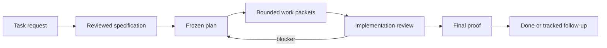

# Agent Lifecycle Kit

Agent Lifecycle Kit is a provider-neutral lifecycle controller for software
agent work. It keeps a task tied to a reviewed specification, a frozen plan,
bounded execution, implementation review, and final proof.

The project is built for one practical outcome: finish the user's task with the
highest quality the selected model can provide while keeping lifecycle overhead
visible and bounded.



## What it provides

- Reviewed specification and plan flow before implementation starts.
- Deterministic task packets for splitting work across agents.
- Fail-closed execution receipts, blocker handling, and final proof.
- Adapter contracts for host-specific projections without putting host details
  in the core.
- Compact context profiles and objective snapshots for small local models.
- Cost and usage accounting that separates product work from lifecycle checks.
- Deterministic cost reports from explicit lifecycle artifacts.
- Usage/session exports with tokens, resources, receipt digests, and optional
  host-reported `cost_usd`.
- Optional proof-integrity evidence for bug fixes and high-risk final proofs:
  stable findings, root-cause digests, fix-impact receipts and hash chains.
- Optional sandbox boundary receipts for high-risk work: filesystem, network,
  process, environment and enforcement-source evidence kept separate from git
  write scope.
- Advisory lifecycle mode recommendations from accumulated cost reports.
- Explicit lifecycle policy proposals with reversible apply artifacts.
- Read-only diagnostics for the current checkout and adapter readiness.

## Quick start

From a source checkout:

```bash
python -m pip install -e .
agent-lifecycle version
agent-lifecycle diagnose --no-install-plans
agent-lifecycle adapter validate --descriptor adapters/codex/adapter.descriptor.json
```

For a short walkthrough, use [Quickstart](docs/guides/quickstart.md). The
Russian documentation starts at [Документация на русском](docs/ru/README.md).

## Daily flow

1. Write or refine the specification.
2. Review the plan and freeze it.
3. Execute bounded task packets.
4. Review implementation against the frozen plan.
5. Finalize only when acceptance, evidence, and residual risk agree.

Useful command groups:

- `agent-lifecycle specification`: specification checks and summaries.
- `agent-lifecycle plan`: plan checks, locks, snapshots, and handoffs.
- `agent-lifecycle workflow`: task execution receipts and final proof.
- `agent-lifecycle audit`: plan and implementation review gates.
- `agent-lifecycle metrics`: lifecycle cost reports, usage exports, and
  validation.
- `agent-lifecycle policy`: opt-in lifecycle policy proposals.
- `agent-lifecycle diagnostics`: redacted evidence bundles.
- `agent-lifecycle diagnose`: checkout readiness without writes or live calls.
- `agent-lifecycle adapter`: descriptor validation, inspection, scaffolding,
  event checks, and dry-run install plans.
- `agent-lifecycle model`, `context`, `goal`, `followup`, `worktree`,
  `runner`, `metrics`, `quality`, `report`, `evidence`, `import`, `contract`,
  and `schema`: supporting lifecycle controls.

The CLI reference is in [CLI reference](docs/reference/cli.md). Source-of-truth
ownership is in [Source of truth](docs/reference/source-of-truth.md).

## Adapter maturity

`EXPERIMENTAL` means the adapter has source projection metadata and deterministic
offline checks, but it is not promoted. `VERIFIED` is host-specific and requires
bounded live host conformance, usage/cost calibration, accepted redacted
evidence, and lifecycle final proof for the tested host range.

| Host | Current claim |
| --- | --- |
| Codex | `VERIFIED` for Codex CLI 0.145.0. Public Plugins Directory approval is not claimed. |
| Claude Code | `VERIFIED` for Claude Code 2.1.220. Official directory approval is not claimed. |
| OpenCode | `VERIFIED` for OpenCode CLI 1.18.9. npm publication is not claimed. |
| Hermes | `VERIFIED` for Hermes Agent v0.19.0. Public directory approval is not claimed. |
| Qwen Code | `VERIFIED` for Qwen Code 0.21.0 on the tested GLM 5.2 binding. Public package approval is not claimed. |
| Cursor | `EXPERIMENTAL`; local safe inspection passed, but accepted live receipts are incomplete. |
| Gemini CLI | `EXPERIMENTAL`; local live canary is blocked by the current Gemini Code Assist tier. |
| Kimi Code | `EXPERIMENTAL`; live proof requires a configured provider and model alias. |

Adapter installation and maturity details live in
[Adapter install](docs/adapters/install.md) and
[Adapter support matrix](docs/adapters/support-matrix.md).

## Contract map

The public lifecycle surface is schema-backed. These names are intentionally
stable and are the compact vocabulary used by the docs, tests, and receipts:

- Completion: `completionCheck`,
  `agent-completion-check-receipt.v1`.
- Goal continuity: `agent-goal-record.v1`,
  `agent-objective-snapshot.v1`.
- Controlled execution: `agent-runner-state.v1`,
  `agent-runner-snapshot.v1`.
- Follow-up tracking: `agent-follow-up-register.v1`,
  `agent-follow-up-summary.v1`.
- Worktree isolation: `agent-worktree-isolation-policy.v1`,
  `agent-worktree-attempt-receipt.v1`.
- Sandbox boundaries: `agent-sandbox-receipt.v1`,
  `agent-sandbox-requirement.v1`, `agent-sandbox-capability.v1`.
- Adapter event capture: `agent-adapter-event-stream-receipt.v1`,
  `agent-adapter-event-capture-validation.v1`.
- Review routing: `agent-review-verdict.v1`,
  `agent-review-routing-summary.v1`.
- Evidence integrity: `agent-proof-finding.v1`,
  `agent-root-cause-evidence.v1`, `agent-fix-impact-receipt.v1`,
  `agent-receipt-hash-chain.v1`, `agent-proof-integrity-receipt.v1`.
- Optional quality checks: `agent-optional-quality-pack.v1`,
  `agent-behavior-check-run.v1`.
- Diagnostics and status views: `agent-diagnostic-bundle.v1`,
  `agent-readonly-status-view.v1`.
- Lifecycle policy proposals: `agent-lifecycle-policy-proposal.v1`,
  `agent-lifecycle-policy-tune-result.v1`.

Full contract details are listed in [Public contracts](docs/reference/public-contracts.md).

## Design boundaries

- The core stays provider-neutral. Concrete host commands and model bindings
  belong to adapters or host-local profiles.
- Small models get compact packets, deterministic checks, and explicit
  next-action lists instead of long narrative state.
- Larger models keep the same gates; better reasoning does not bypass evidence.
- A dry run, scaffold, inspection, or synthetic replay cannot promote an
  adapter.
- Public release claims are limited to tracked source files and redacted
  evidence summaries.
- Git write scope governs repository paths; sandbox receipts govern runtime
  containment and may be `UNKNOWN` until separately verified.

## Documentation

- [English documentation](docs/README.md)
- [Русская документация](docs/ru/README.md)
- [Quickstart](docs/guides/quickstart.md)
- [Adapter install](docs/adapters/install.md)
- [Readiness diagnostics](docs/reference/readiness-diagnostics.md)
- [Lifecycle cost accounting](docs/reference/lifecycle-cost.md)
- [Usage export](docs/reference/usage-export.md)
- [Evidence integrity](docs/reference/evidence-integrity.md)
- [Sandbox boundaries](docs/reference/sandbox-boundaries.md)
- [Release security](docs/security/release-security.md)

## License

Apache-2.0. See [LICENSE](LICENSE).
