# System architecture

This document describes Agent Lifecycle Kit (ALK) as a provider-neutral
lifecycle controller for coding-agent work. It uses C4-style levels plus a C0
mission view:

- C0 explains the mission boundary.
- C1 shows ALK in its external environment.
- C2 breaks ALK into deployable/source containers.
- C3 breaks the runtime package into components.
- C4 names the code-level call paths and design patterns.

The detailed module boundary map remains in
[Modular controller architecture](modular-controller.md). This document focuses
on how the pieces work together for common operator flows.

## C0: mission context

ALK solves completion control for coding-agent work. It keeps user intent,
reviewed authority, bounded execution, evidence and acceptance consistent until
the external agent's result is verified or explicitly blocked. It provides
contracts, state transitions, gates and evidence without becoming another
coding-agent runtime. Host CLIs still perform model work, editing and tool
execution.

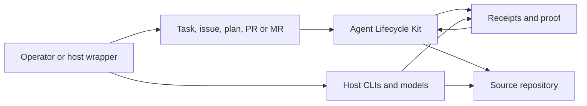

The main architectural rule is separation of authority:

- ALK owns lifecycle truth: specification, plan, state, receipts, gates and
  final proof.
- The repository owns source code, tests, documentation and release metadata.
- Adapters own host-specific command projection, environment boundaries and
  local launch profiles.
- Hosts own model execution and provider credentials.
- Reviewers own semantic judgement; ALK records and validates the evidence.

## Responsibility model: ALK, host, model and repository

The participants form one workflow with different authorities:

| Participant | Contribution | Durable result |
| --- | --- | --- |
| ALK core | Classifies intake, validates contracts, advances state and applies gates. | Plans, locks, state transitions, receipts and final proof. |
| Host CLI and adapter | Provides the user interface, command projection and host-local environment. | Adapter receipts, host-boundary evidence and selected model invocation. |
| Model | Researches the task, explains options, proposes a plan and writes or reviews code through the host tools. | Research, plan content, implementation changes and review findings. |
| Repository | Stores source code, tests, documentation, plan packages and release metadata. | The durable project history against which the task is checked. |
| Operator or independent reviewer | Approves scope, resolves questions and evaluates semantic correctness. | Review decisions and authorization for the next lifecycle step. |

The model supplies reasoning and content. ALK supplies the structure that makes
that content reviewable: identity, scope, ownership, validation, evidence and a
decision. The host is the execution surface; the repository is the durable
project context; ALK connects both through typed artifacts.

## How the guarantee chain is formed

The lifecycle result is accepted through a sequence of linked artifacts:

1. **Intake receipt** records the task text, file or imported context and its
   digest.
2. **Specification and plan** define the expected result, constraints,
   acceptance criteria, workstreams, allowed files, budgets and evidence routes.
3. **Independent plan review** checks completeness, references, ownership,
   security and the selected lifecycle depth.
4. **Frozen manifest and lock** bind the reviewed plan to one immutable
   implementation identity.
5. **Task and validation receipts** show the work performed, checks run,
   changed files, resource usage and unresolved actions.
6. **Implementation audit** compares the result with the frozen plan and its
   acceptance evidence.
7. **Final proof** combines the accepted evidence and exposes the resulting
   status to the operator and release process.

The visible states are actionable: `PASS` means the required evidence is
accepted, `REVIEW_REQUIRED` identifies the missing decision or review, and
`BLOCKED` records the reason that prevents the next transition. Accepted
lifecycle artifacts include the reviewed plan and lock, state and task
receipts, validation and evidence summaries, independent plan and
implementation audits, and final proof. Review Mesh, Bug Forensics, progress
and resource receipts add evidence when the selected task or plan requires it.

The guarantee boundary is explicit:

| Evidence class | What ALK can verify deterministically | What still depends on task evidence |
| --- | --- | --- |
| Contract and process | Schema shape, hashes, ownership, allowed paths, state transitions, required commands and receipt lineage. | Whether the selected requirements describe the right product outcome. |
| Code and behavior | Test results, validation output, changed-file scope, resource limits and audit completeness. | Semantic correctness of research, design and implementation; the plan must require tests, review or domain evidence for it. |
| Host and model | Adapter identity, declared capabilities, environment boundary and attested usage. | The quality of model reasoning and the behavior of tools supplied by the host. |

## Release 1.77 quality and packaging boundaries

Release 1.77 adds maintenance controls around the existing lifecycle
architecture. Ruff, mypy and coverage are development-only tools executed by a
bounded release runner; they do not become runtime dependencies or a new
execution authority. The quality policy keeps legacy findings tied to source
digests and prevents new or growing debt.

The root CLI remains the composition boundary. It translates expected I/O,
decoding, JSON-depth and unexpected failures into the stable
`agent-lifecycle-error.v1` contract, while domain libraries keep their native
exceptions and interruption semantics. The CLI therefore exposes a safe
machine-readable boundary without moving lifecycle rules into the parser.

Built-in profiles are data owned by the package resource layer. Their reviewed
source copies and installed copies are digest-checked, and `importlib.resources`
resolves them independently of the current directory. An explicit operator
path has higher precedence; a project file cannot shadow a built-in default.

The supported Python API is an explicit allowlist of the root package and
selected opt-in facades. The validator checks imports, exports, annotations and
English/Russian documentation. Internal modules remain implementation details
unless they are listed in that contract.

## Release 1.78 performance boundaries

Release 1.78 optimizes repeated local work without changing lifecycle
authority. The performance policy and typed ceilings are separate from the
plan, lock and acceptance authorities: a faster measurement can never approve
an implementation or replace a required security check.

The Ed25519 implementation uses iterative extended-coordinate arithmetic and is
checked against published vectors, accepted receipt fixtures and malformed
inputs. Neutrality scanning uses bounded Git batch streams and a differential
literal matcher; worktree identity uses bounded streaming reads; Linux group
enumeration has a separate cadence; and the root CLI loads command families
only after selection. Each optimization retains shell-free execution, fail
closed limits, stable reads, before/after identity captures, redaction and
deterministic evidence.

The performance harness records revision, environment, samples and bounded
operation summaries under `work/`. Wall time and memory are advisory unless a
plan gives them an explicit threshold. The one 1.78 timing gate is an
interleaved Ed25519 median comparison against the frozen affine reference;
there is no constant-time claim and no runtime dependency or cache-based
shortcut. See [performance and resource budgets](../reference/performance-and-resource-budgets.md).

## C1: system context

At system level ALK is a local CLI and Python package used inside a source
checkout. It reads and writes structured artifacts, but does not require a
server, daemon, database or provider API.

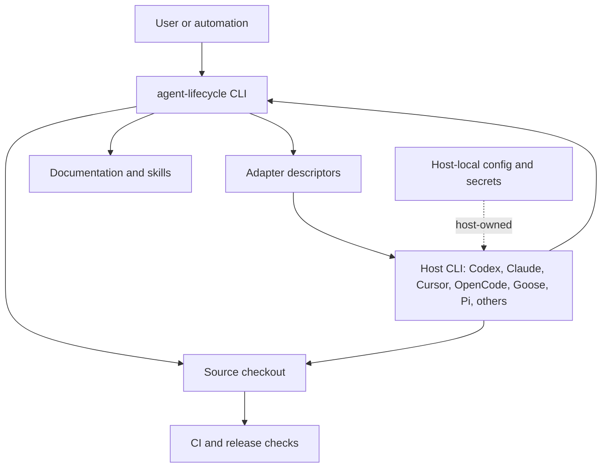

Important boundaries:

- Portable artifacts must not store raw secrets, private environment values or
  absolute local paths.
- `adapter task start` accepts raw task text or Markdown only as draft intake.
- Managed execution requires a frozen run request or a frozen plan bound to
  workflow state.
- Optional multi-review evidence is host-owned: ALK prepares assignments,
  imports redacted results, synthesizes findings and validates quorum.

## C2: containers

The repository is source-only. The "containers" here are source/runtime
containers, not Docker services.

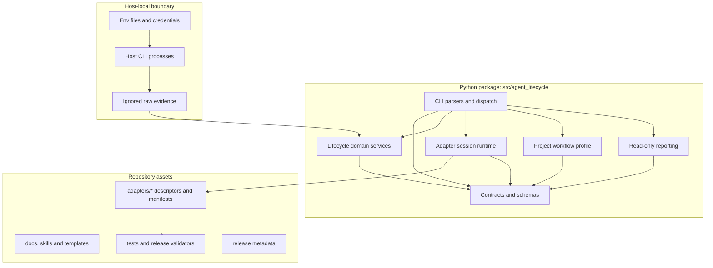

| Container | Responsibility | Must not do |
| --- | --- | --- |
| `src/agent_lifecycle/cli` | Parse arguments, route commands, render stable JSON or terminal progress. | Hold lifecycle semantics or provider logic. |
| `src/agent_lifecycle/contracts` | Public schemas, canonical JSON, digests, typed errors and compatibility policy. | Depend on host CLIs. |
| Domain packages | Planning, workflow, audit, context, metrics, quality, review coordination and reporting. | Start provider API calls directly. |
| `src/agent_lifecycle/adapter_sessions` | Descriptor-driven session records, task intake and managed-run bridge. | Inject prompts or parse host telemetry in core. |
| `src/agent_lifecycle/project` | Project-local workflow defaults, bounded stage settings and deterministic effective-profile composition. | Replace a frozen plan, execute guidance or store provider authority. |
| `src/agent_lifecycle/research` | Validate bounded sources, claims, citations and provenance before research is used as planning input. | Fetch sources, call models, execute source instructions or become a lifecycle authority. |
| `adapters/*` | Host descriptors, operation projections, support manifests and evidence summaries. | Change lifecycle schemas. |
| `tools/release` and tests | Release gates, validators, conformance and docs compatibility. | Establish a live host support level from synthetic data alone. |

### Enforced module boundaries

The exact reviewed layer policy is stored in
`policy/architecture-dependencies.json`. Release validation builds the module
and package graph, includes imports declared inside functions, checks that the
graph is acyclic, and rejects an edge that points from a lower layer to a
higher layer. CI also checks the documented file, function and symbol limits.
The policy and validators turn the architecture into a repeatable release
condition; a diagram alone is not evidence of compliance.

The runtime split keeps the security-sensitive process boundary explicit:
`adapter_sessions/process.py` owns bounded process creation and cleanup,
`process_capture.py` owns capped stream capture, and `process_control.py` owns
timeouts, cancellation and result assembly. Compatible facades preserve the
public launcher and start paths. Shared persistence and validation primitives
are kept in `contracts` only when their semantics are identical.

Adapter inspection is data-driven. Every bundled adapter has a bounded,
literal-only `inspection_profile.py`. ALK validates the profile before resolving
an allow-listed inspection handler, never imports adapter code while reading
the profile, and returns an unsupported result without starting a host process.
This makes the open/closed boundary testable without moving host-specific
commands into the lifecycle core.

### Project continuity artifacts

The project-profile layer may reference a bounded `agent-project-principles.v1`
artifact by path and digest. `project/principles.py` validates its limits and
authority boundary; `project/profile.py` and `project/merge.py` carry only the
reference into the effective profile. The principles file is context, not a
specification or execution authority.

`planning/deltas.py` compares two explicit plan revisions. It projects
requirements, writes, acceptance, evidence, budgets, risks and gates into
digest-only change summaries. `plan delta` never mutates a manifest or lock;
authority changes set `reviewRequired` and `newLockRequired` so the normal
review and freeze process must run again.

## C3: runtime component map

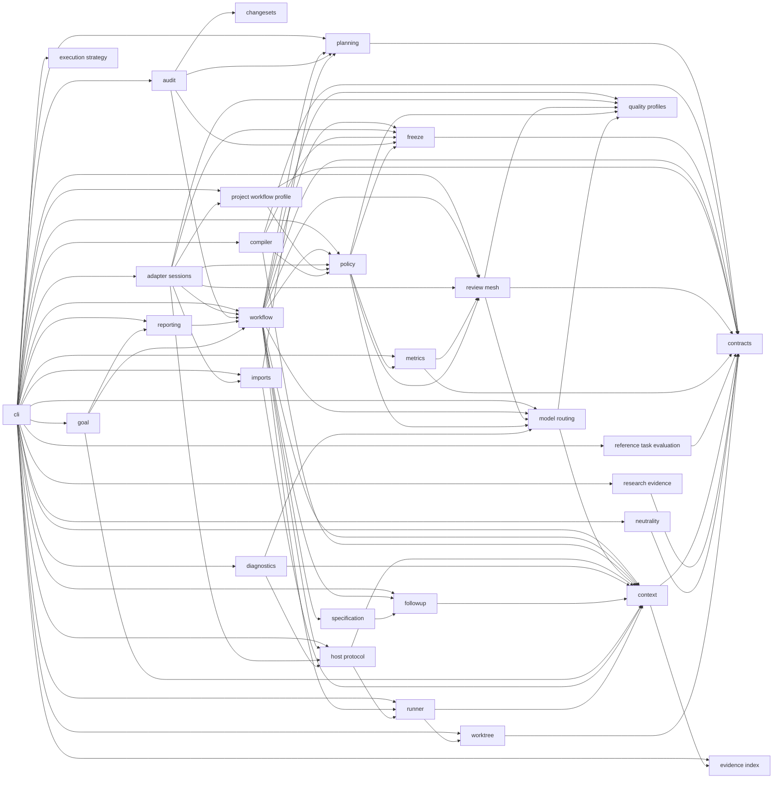

The diagram shows the principal non-contract edges. The exact module and
package graph, including function-local imports and the fan-in into
`contracts`, is validated by `policy/architecture-dependencies.json` and the
release validator. The graph is acyclic and every edge follows the reviewed
layer direction.

| Component | Main modules | Called when |
| --- | --- | --- |
| CLI routing | `cli/main.py`, `cli/parsers.py`, `cli/dispatch.py`, `cli/dispatch_adapters.py`, `cli/dispatch_contracts.py`, `cli/dispatch_lifecycle.py`, `cli/dispatch_observability.py`, `cli/dispatch_planning.py`, `cli/adapter.py` | Any `agent-lifecycle ...` command starts here; the root dispatcher selects a focused command-group handler. |
| Contracts | `contracts/*` | Every public receipt, schema, digest and validation envelope. |
| Change discovery | `changesets/git.py` | Ownership and implementation audit over Git diffs. |
| Compilation | `compiler/task_packets.py`, `compiler/small_model_packets.py` | Frozen DAG to task packets and compact model packets. |
| Planning | `planning/*`, `specification/*`, `freeze/locks.py` | SDD tier, plan checks, completeness, acceptance and lock verification. |
| Workflow | `workflow/*` | State mutation, task transitions, finalization and managed next actions. |
| Adapter sessions | `adapter_sessions/*` | `adapter session`, `adapter task start`, `adapter run`, local profile validation and explicit frozen host launch. |
| Project workflow profile and presets | `project/profile.py`, `project/merge.py`, `project/presets.py`, `project/guidance.py`, `cli/project.py` | `project profile` and `project preset list/inspect/validate/render`, plus `start` when a local profile or preset is selected. Presets provide bounded defaults; profile, CLI and frozen-plan authority remain separate. |
| Host protocol | `host_protocol/*` | Adapter validation, inspection, event capture and capability checks. |
| Optional thread bridge | `host_protocol/thread_bridge.py`, `policy/thread_bridge.py`, `context/thread_bridge_context.py` | Prepare and validate host-thread requests, import bounded context and expose it to retrieval or Review Mesh. Native thread calls remain adapter-owned. |
| Audit | `audit/*` | Ownership checks, review verdicts, implementation audit, proof integrity. |
| Review coordination | `review_mesh/*` | Optional recommendation, operator templates, reviewer packet preparation, assignments, result import, synthesis and quorum. |
| Reporting | `reporting/*` | Read-only status, event feed, progress, change summary and progress bridge. |
| Metrics and policy | `metrics/*`, `policy/*`, `model_routing/*` | Usage export, token/resource policy, quality-cost signals and model class routing. |
| Execution strategy | `policy/execution_strategy.py`, `cli/strategy.py` | Compose existing risk, quality, routing, compact-packet and review decisions into one read-only receipt. |
| Reference task evaluation and execution-setup validation | `benchmarks/contracts.py`, `benchmarks/stratification.py`, `benchmarks/qualification.py`, `benchmarks/comparison.py`, `contracts/benchmark_schemas.py`, `cli/benchmarks.py` | Build a deterministic family/tier/shape sample, validate execution records with sensitive data removed, validate setups only after minimum evidence, and compare quality before resource and token-confidence signals. |
| Context and evidence | `context/*`, `evidence_index/*`, `goal/*`, `followup/*` | Small packets, episode retrieval, external context imports, goal views and continuation records. |
| Research evidence | `research/*`, `contracts/research_evidence_schemas.py`, `cli/research.py` | Local validation of `agent-research-evidence-package.v1` source, claim, citation and provenance bindings; bounded summary for draft planning input. |
| Neutrality | `neutrality/scanner.py`, `neutrality/paths.py`, `neutrality/receipt.py`, `neutrality/gate.py` | Git-index-bound release scanning, optional policy-limited local evidence, stable reads, authority checks and signed neutrality receipts. |
| Runner | `runner/*` | Bounded execution-loop state over existing workflow primitives. |
| Worktree | `worktree/*`, `cli/worktree.py` | Worktree isolation policies and attempt receipts. |

## C4: code-level call paths

For long-running project governance the call path is:

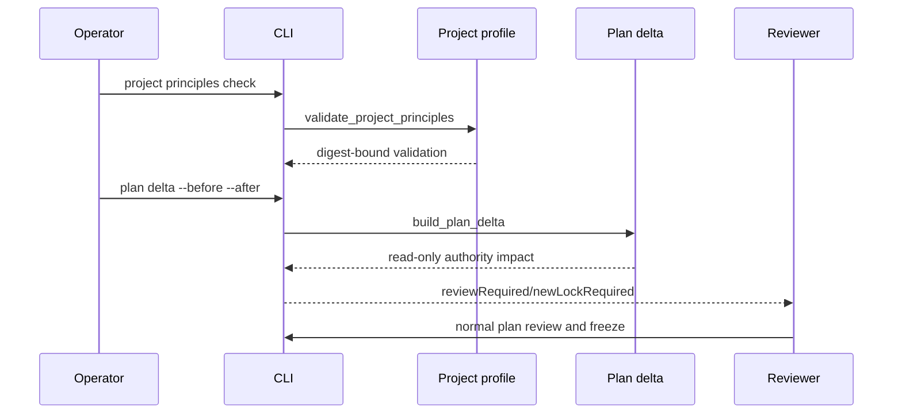

The C4 level below names concrete functions and modules. It is intentionally
limited to the public paths operators actually use.

### Command dispatch

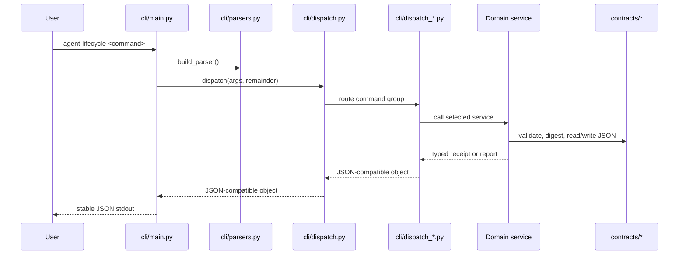

Pattern: command dispatcher plus functional core. `cli/dispatch.py` selects the
unified start facade or one of five command-group handlers:
adapters/readiness, contracts/evidence, lifecycle, observability or planning.
CLI modules stay thin; domain services own behavior and tests.

### Optional thread bridge

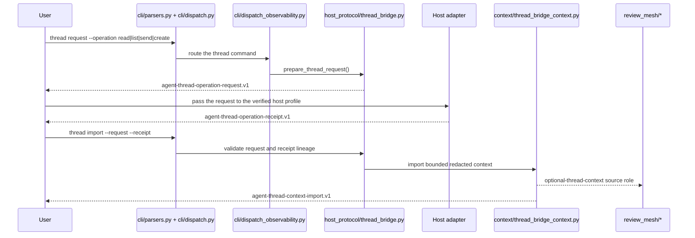

The bridge is an explicit transport path. The core prepares, validates and
redacts artifacts; the adapter owns the native thread operation. Imported
content remains external context and cannot become plan authority, acceptance
evidence or final proof.

### Adapter capability qualification

Release 1.66 adds `contracts/thread_bridge_schemas.py` profiles and
qualification receipts. `host_protocol/capabilities.py` projects each
operation into the existing `capability_support` values. The descriptor
status (`UNSUPPORTED`, `WRAPPER_ONLY` or `SUPPORTED`) is separate from the
project policy mode. `SUPPORTED` is projected only after a receipt matches the
descriptor digest, the capability-manifest identity, host range, operation set
and policy version. `cli/adapter.py` exposes
`adapter thread-capability` and `adapter thread-qualify`; both are local
inspection commands and do not launch a host.

### Unified lifecycle start

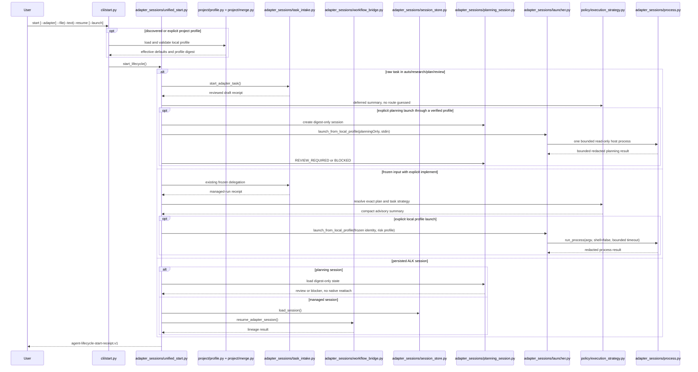

The facade selects existing authorities; it does not own workflow transitions.
When a project profile is active, `cli/project.py` loads it from the current
project root and `project/merge.py` composes its defaults with the frozen plan
and lock before `unified_start.py` builds the guided receipt. The profile digest
is carried into the strategy projection; the base start receipt remains the
same nested lifecycle result, wrapped as `agent-guided-action-receipt.v1`.
Raw task modes cannot call managed implementation. They may reach only a
separately verified `planningOnly` profile through explicit `--launch`, and
that process must end at review or block with unchanged repository identity.
Frozen delegation requires explicit `implement` and complete bindings. Resume
accepts only stored ALK state and never interprets a native host conversation
identifier. Generic descriptor and interactive-session launch remain blocked.

### Execution strategy and comparison

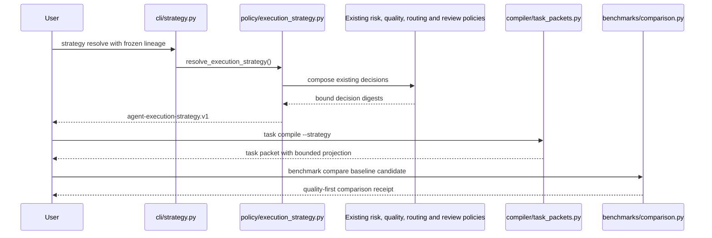

Both paths are deterministic and read-only. The strategy cannot lower the
frozen quality floor, and protected S2 work cannot enter a compact packet.
Comparison checks false acceptances and oracle lineage before resource deltas;
automatic adoption eligibility additionally requires attested savings, no
observed resource regression and complete measurements.

### Reference-task execution-setup validation

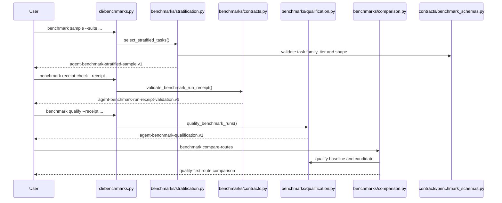

The validation path is local and deterministic. The external harness runs
the reference tasks and produces an execution record with sensitive data removed; ALK validates
task lineage, execution setup, environment, scorer, quality counts,
false-acceptance status, measurement gaps and the record digest. Sampling is
stratified by task family, lifecycle tier and bounded task shape so one easy
task cannot represent an entire setup. An execution setup is `QUALIFIED` only
after at least five distinct tasks,
two completed runs per task, five distinct strata and two completed runs per
stratum. Otherwise the result is `NO_RECOMMENDATION`, not a quality claim.

Qualification compares quality and false acceptance before retries, elapsed
time, tokens or other resources. Missing measurements remain explicit and are
never treated as no usage. The process does not call a model, launch a host or
change an execution policy; an operator may use the result to choose an execution setup,
but adoption requires a separate approved lifecycle change.

### Raw task or Markdown intake

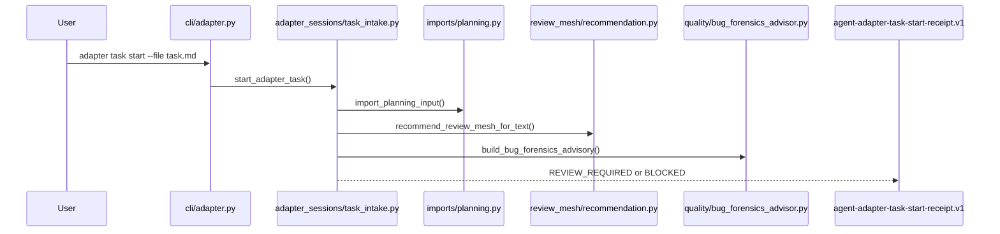

Called for raw task text, Markdown, code-review packets and imported planning
input. It never starts implementation. The receipt stores source label, digest
and byte count, not raw task text. Review Mesh and Bug Forensics suggestions
remain advisory until a reviewed frozen plan opts into blocking gates.

### Frozen managed adapter run

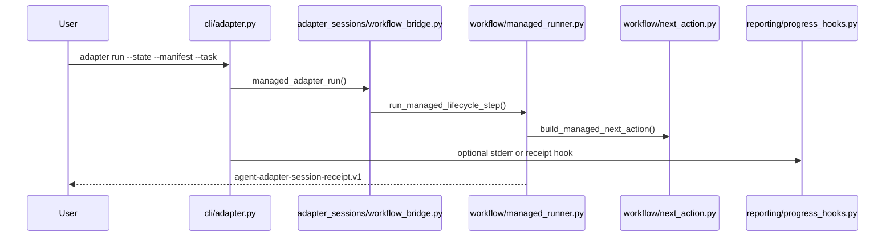

Called only when a frozen plan and workflow binding are supplied. ALK returns
the next lifecycle action; it does not become the host model runtime.

### Workflow state mutation

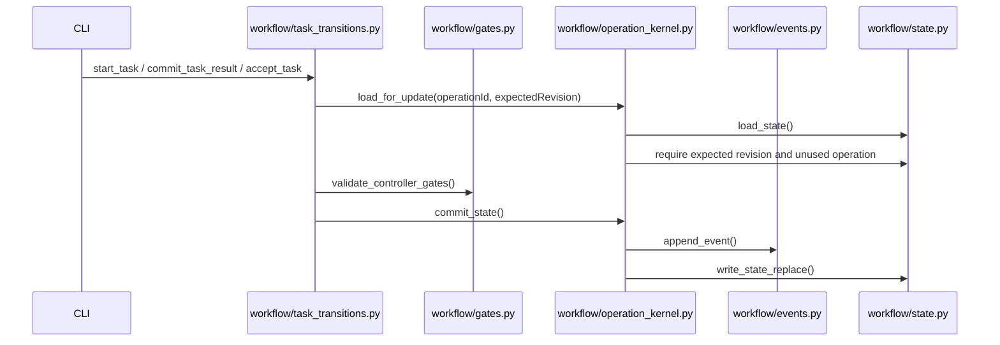

Patterns: state machine, operation kernel, optimistic revision check,
idempotency key and append-only event log. Mutating workflow commands fail
closed on stale revisions, duplicate operation ids and missing required gates.

### Code review for GitHub or GitLab changes

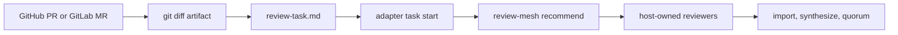

Called when the operator wants a structured review of a local branch, GitHub
pull request or GitLab merge request. Git integration remains outside ALK; ALK
receives a stable review packet.

### Optional multi-review coordination

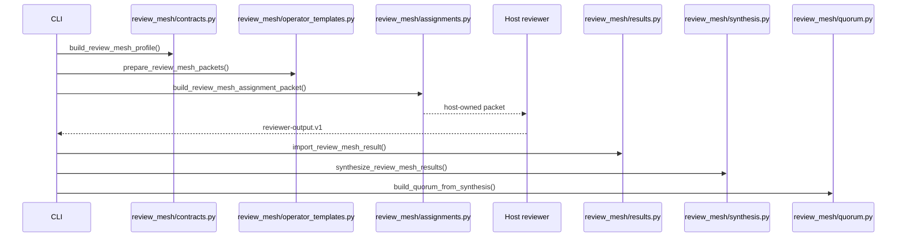

Called for leader-draft review, parallel research synthesis or implementation
audit panels. The core does not launch reviewers. Quorum blocks only when the
frozen plan explicitly opts in for that phase.

### Implementation audit

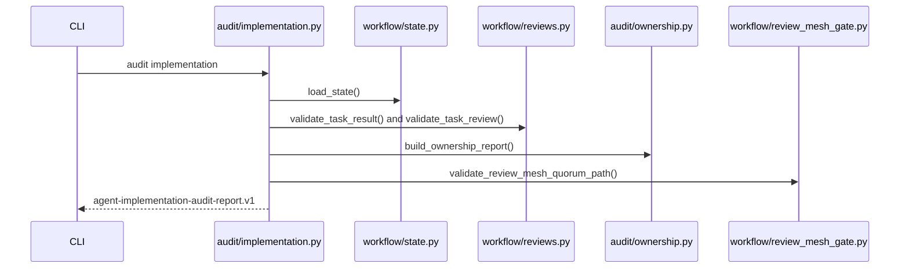

Called after an implementation attempt has a task result and independent
review. It verifies lineage, ownership, evidence, acceptance coverage,
sandbox receipts and optional multi-review quorum.

### Package audit

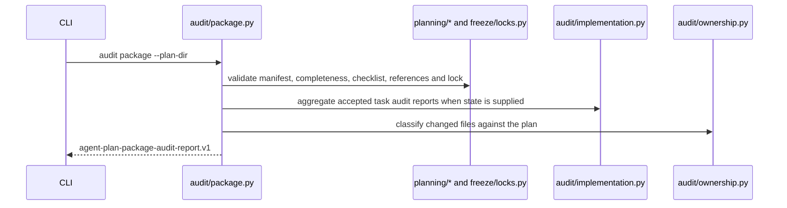

This is the handoff route for a plan and its completed implementation. It
composes existing validators and reports `PASS`, `REVIEW_REQUIRED` or `FAIL`
without changing workflow state or starting an external tool.

### Read-only progress and reporting

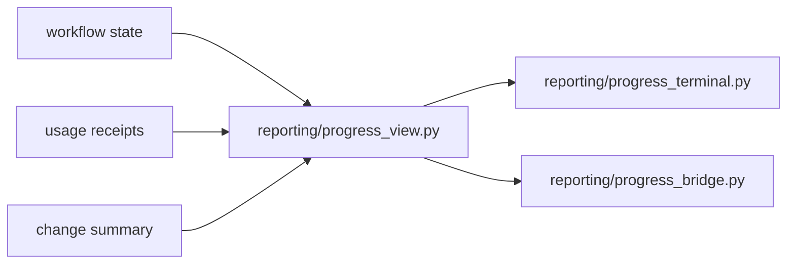

Called by `report progress`, `report progress-bridge` and progress hooks on
managed workflow commands. Reporting is read-only, starts no model calls and
does not parse host-specific telemetry in the core.

### Release neutrality scan

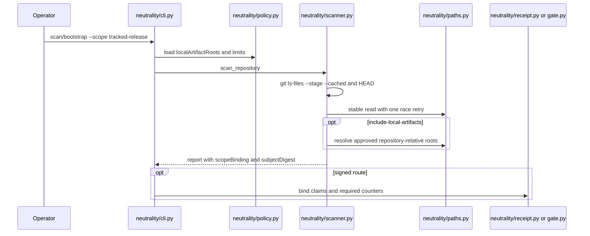

Release workflows use `tracked-release` without local artifacts. A dedicated
evidence step may opt in to roots declared by policy. Legacy scopes retain
their old enumeration behavior but carry a signed deprecation marker.

## Work variants and call routing

| Variant | Operator command | Primary modules | Output |
| --- | --- | --- | --- |
| Readiness check | `diagnose --no-install-plans` | `diagnostics/readiness.py`, `host_protocol/*`, `context/*` | Redacted readiness report. |
| Adapter validation | `adapter validate/inspect/install-plan` | `cli/adapter.py`, `host_protocol/*`, `diagnostics/readiness.py` | Validation, safe inspection or dry-run install plan. |
| Raw task intake | `adapter task start --file/--text` | `adapter_sessions/task_intake.py`, `imports/planning.py`, `review_mesh/recommendation.py`, `quality/bug_forensics_advisor.py` | Review-gated intake receipt. |
| Project-guided start | `project profile init/check`, `start --project-profile` or discovered `.alk/project-profile.json` | `cli/project.py`, `project/profile.py`, `project/merge.py`, `adapter_sessions/unified_start.py` | Effective profile and guided action receipt; plan and lock authority remain unchanged. |
| Workflow preset | `project preset list/inspect/validate/render`, `start --preset` | `cli/project.py`, `project/presets.py`, `project/profile.py`, `project/merge.py`, `contracts/project_profile_preset_schemas.py` | Local preset list, validation, render receipt or guided action defaults; no model or host launch. |
| Plan validation | `plan check`, `plan completeness-check`, `plan acceptance-check` | `planning/*`, `freeze/locks.py` | PASS/FAIL plan evidence. |
| Managed next action | `workflow run` or `adapter run` | `workflow/managed_runner.py`, `workflow/next_action.py`, `adapter_sessions/workflow_bridge.py` | Next action receipt, no host launch. |
| Task mutation | `workflow task-start/task-result/task-accept` | `workflow/task_transitions.py`, `workflow/operation_kernel.py`, `workflow/gates.py` | Updated workflow state and event log. |
| Implementation audit | `audit implementation` | `audit/implementation.py`, `audit/ownership.py`, `workflow/reviews.py` | Implementation audit report. |
| Package audit | `audit package --plan-dir` | `audit/package.py`, `planning/*`, `freeze/locks.py`, `audit/implementation.py`, `audit/ownership.py` | Plan and implementation handoff report. |
| Group review | `review-mesh profile/recommend/prepare/assign/import-result/synthesize/quorum` | `review_mesh/*`, `model_routing/profiles.py`, `quality/cross_check.py` | Recommendation, prepared reviewer packets, assignment, result, synthesis and quorum receipts. |
| Code review | Git/host CLI plus `adapter task start` | Git outside ALK, then `adapter_sessions/task_intake.py` and optional `review_mesh/*` | Review packet intake and optional quorum. |
| Bug repair | `adapter task start` plus frozen plan gates | `adapter_sessions/task_intake.py`, `quality/bug_forensics_advisor.py`, `quality/bug_forensics.py`, `audit/bug_forensics.py`, `workflow/bug_forensics_gates.py` | Defect-shaped recommendation, then plan-required receipts. |
| External context | `context external-import` and episode retrieval | `context/external_memory.py`, `evidence_index/external_context.py`, `evidence_index/episode_index.py` | Optional context hints with no proof authority. |
| Research evidence | `research validate`, `research summary` | `cli/research.py`, `research/validation.py`, `research/provenance.py`, `contracts/research_evidence_schemas.py` | Local source-to-claim validation and bounded summary; no source fetch, model call or lifecycle authority. |
| Thread context | `thread request` and `thread import` | `host_protocol/thread_bridge.py`, `policy/thread_bridge.py`, `context/thread_bridge_context.py`, optional `review_mesh/*` | Bounded thread request, adapter receipt and optional context import. |
| Thread capability qualification | `adapter thread-capability`, `adapter thread-qualify` | `contracts/thread_bridge_schemas.py`, `host_protocol/capabilities.py`, `host_protocol/validation.py`, `adapters/*` | Descriptor-bound declaration and qualification result; no host call from the core. |
| Goal status | `goal view` | `goal/view.py`, `reporting/progress_view.py`, `workflow/query.py` | Read-only goal and lifecycle progress view. |
| Execution strategy | `strategy resolve`, then optional `task compile --strategy` | `policy/execution_strategy.py`, `cli/strategy.py`, `compiler/*` | Read-only full strategy and bounded task-packet projection. |
| Reference comparison | `benchmark evaluate`, `benchmark compare` | `benchmarks/*`, `contracts/benchmark_schemas.py` | Deterministic evaluation or quality-first comparison with no model or host call and no production claim. |
| Progress display | `report progress`, `report progress-bridge`, progress hooks | `reporting/*`, `cli/progress_hooks.py` | Terminal or JSON progress without model calls. |
| Release check | Release tools and tests | `tools/release/*`, `contracts/release_contract_schemas.py`, docs/tests | Source-release validation and evidence. |

## Design patterns

| Pattern | Where it appears | Why it is used |
| --- | --- | --- |
| Ports and adapters | `adapters/*`, `host_protocol/*`, `adapter_sessions/*` | Keep host-specific commands, secrets and capabilities outside lifecycle core. |
| Contract-first design | `contracts/*`, `schemas.py`, public `.v1` receipts | Make every lifecycle claim machine-checkable and portable. |
| Command dispatcher | `cli/main.py`, `cli/parsers.py`, `cli/dispatch.py`, `cli/dispatch_*.py` | Keep the root CLI thin and route each command group to its domain handler. |
| Functional core, imperative shell | Builders and validators return dictionaries; CLI handles paths and output. | Improve testability and small-model readability. |
| State machine | `workflow/state.py`, `workflow/task_transitions.py`, `runner/core.py` | Make lifecycle phases explicit and fail closed on invalid transitions. |
| Operation kernel | `workflow/operation_kernel.py` | Centralize expected revision checks, idempotency and state/event commits. |
| Gate pipeline | `workflow/gates.py`, audit gates, completion gates, review quorum gates | Prevent acceptance or finalization when required evidence is missing. |
| Strategy and policy | `policy/execution_strategy.py`, other `policy/*`, `model_routing/*`, `metrics/recommendations.py` | Compose safe lifecycle/model routes without duplicating lower-level authorities or hardcoding providers. |
| Facade | `audit/implementation.py`, `diagnostics/bundles.py`, `reporting/*` | Package multiple checks into one typed receipt without duplicating lower-level logic. |
| Builder and validator pair | Most contract modules and release validators | Produce deterministic receipts and verify them independently. |
| Fail-closed boundary | Imports, adapter launch, review result import, release gates | Reject unsafe or under-evidenced paths instead of guessing. |

## Architectural rules

- Lifecycle semantics live in domain packages, not adapters or CLI rendering.
- Adapters may describe host capabilities and local launch boundaries, but they
  must not own workflow truth.
- Raw input is never execution authority.
- A recommendation is not a gate. A gate exists only when a frozen plan opts in.
- Read-only views do not mutate state and do not start model calls.
- Execution strategy is advisory, preserves the frozen quality floor and never
  grants workflow or host-launch authority.
- Usage and progress use token/resource evidence; monetary cost is optional and
  only accepted when a metered host reports it.
- Public release claims must be backed by tracked summaries and, when needed,
  host-local redacted live receipts.

## Related documents

- [Modular controller architecture](modular-controller.md)
- [Runner transition contract](runner-transition-contract.md)
- [Runner extension map](runner-extension-map.md)
- [Release architecture](release-architecture.md)
- [Source of truth](../reference/source-of-truth.md)
- [Managed adapter sessions](../reference/managed-adapter-sessions.md)
- [Project workflow profile](../reference/project-workflow-profile.md)
- [Implementation audit](../reference/implementation-audit.md)
- [Review Mesh workflow scenarios](../guides/review-mesh-workflow.md)
- [Code review workflows](../guides/code-review-workflows.md)
- [External memory](../reference/external-memory.md)
- [Goal continuity](../reference/goal-continuity.md)
- [Bug Forensics profile](../reference/bug-forensics.md)
- [Quality-preserving execution strategy](../reference/execution-strategy.md)
- [Neutrality scanning](../reference/neutrality.md)
- [Performance and resource budgets](../reference/performance-and-resource-budgets.md)
- [Context checkpoints and compaction recovery](../reference/context-checkpoints.md)
