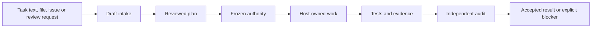

# How ALK works for different tasks

Agent Lifecycle Kit (ALK) solves the completion-control problem around coding
agents. It keeps the requested outcome, reviewed plan, execution boundaries,
evidence and acceptance decisions consistent until work is either verified or
explicitly blocked. The external coding agent still performs research, writes
code and uses tools; ALK does not replace that agent or its model runtime.

This distinction matters when choosing a workflow. A raw task passed to
`agent-lifecycle start` becomes reviewed draft intake. It does not become an
authorized implementation merely because a plugin is installed or `--launch`
is present.

For a capability-by-capability explanation of multiple agents, plan-level
workflow customization, host model settings, prompts, timeouts and retries, see
[Workflow customization and execution controls](../reference/workflow-customization.md).

To get started, begin with [Install ALK and make the first run](install-and-first-run.md)
and [Commands by task](commands-by-task.md). This page explains the lifecycle
behind those commands.

For project-wide defaults, use a local [project workflow
profile](../reference/project-workflow-profile.md). `project profile init`
creates the file, and an active profile adds a bounded guided action projection
to `start` as `agent-guided-action-receipt.v1`; a frozen plan and matching lock
remain authoritative.
The project workflow profile is a local defaults layer, not a second plan.

## One lifecycle authority

Durable workflow state is the only authority for phase, task status,
authorization, acceptance, blockers and final proof. `workflow run` projects the
next action from that state. Historical runner records are converted only by
the explicit read-only `workflow migrate-runner-artifact` route; they cannot
advance workflow state or make an acceptance decision. The closed action catalog
and its release validator keep workflow, host gates and CLI projections aligned.

## The participants

| Participant | Responsibility |
| --- | --- |
| User or operator | Defines the expected result, approves consequential decisions and supplies external authority. |
| ALK | Preserves lifecycle state, plan authority, write boundaries, checks, receipts and final proof. |
| Host adapter | Translates portable ALK actions into host-local commands and keeps secrets and telemetry outside core. |
| Coding agent | Researches, plans, edits files and runs tools within the approved task boundary. |
| Independent reviewer | Evaluates the plan or implementation without inheriting the implementer's conclusion. |

## The common lifecycle



The full path is required only when implementation authority and completion
proof are needed. Research, planning and review can stop earlier with a
reviewed artifact and no implementation claim.

## Choose proportional depth

ALK uses the smallest lifecycle tier that preserves the required quality:

| Tier | Use it for | Required control |
| --- | --- | --- |
| S0 | One bounded mechanical task with one owner and no elevated risk | Exact write scope and at least one validation route. |
| S1 | Normal product work owned by one execution stream | Requirements, acceptance criteria, evidence, validation and release impact. |
| S2 | Architecture, security, performance, browser, external-environment or multi-owner work | Full ownership, dependency graph, budgets, context limits, security gates and final audit gates. |

For a small one-off edit, ALK may be unnecessary. Do not promote routine work
to S2 only to produce more process artifacts.

## Start from text or one Markdown file

Use the public facade to record and classify an input:

```bash
agent-lifecycle start --adapter codex --text "Investigate the failing checkout test"
agent-lifecycle start --adapter codex --file task.md
```

The default `auto` mode returns `agent-lifecycle-start-receipt.v1`. For raw
text or Markdown its action remains draft review. ALK may recommend Bug
Forensics or multi-model review, but a recommendation does not activate a blocking
gate and does not start implementation.

The host agent can use the `agent-workflow-orchestrator` skill to carry the
request through the lifecycle. Installing the skill makes the procedure
available; the receipts and state transitions prove whether it was actually
followed.

## Research or analysis only

1. State the question and the required output in a Markdown file.
2. Record the non-executing intake:

```bash
agent-lifecycle start \
  --adapter codex \
  --mode research \
  --file research.md \
  --out work/research/start.json
```

3. Let the selected host agent perform the research. ALK core does not call the
   model for this command.
4. Review the resulting report and stop. Do not create implementation
   authority or claim lifecycle completion for code that was not requested.

The useful result is the reviewed research artifact, not a frozen
implementation run.

## Produce a plan without implementation

For one task file:

```bash
agent-lifecycle start \
  --adapter codex \
  --mode plan \
  --file feature.md \
  --out work/planning/start.json
```

For a directory of OpenSpec, Spec Kit, BMAD or Spec Kitty Markdown files:

```bash
agent-lifecycle import plan \
  --source specs/checkout/ \
  --dialect spec-kit \
  --out work/planning/import.json
```

The host agent turns this draft input into the plan package. Before the plan can
authorize work, validate its structure and acceptance crosswalk:

```bash
agent-lifecycle plan completeness-check --manifest tasks/my-plan/plan.manifest.json
agent-lifecycle plan acceptance-check \
  --manifest tasks/my-plan/plan.manifest.json \
  --acceptance tasks/my-plan/acceptance-criteria.md
agent-lifecycle plan refs-check --manifest tasks/my-plan/plan.manifest.json
agent-lifecycle plan check \
  --manifest tasks/my-plan/plan.manifest.json \
  --lock tasks/my-plan/plan.lock.json \
  --require-completeness
```

Structural `PASS` is not independent approval. A separate reviewer must audit
an S2 plan before it is frozen.

## Review a plan or architecture

```bash
agent-lifecycle start \
  --adapter codex \
  --mode review \
  --file proposed-plan.md \
  --out work/review/start.json

agent-lifecycle review-mesh recommend \
  --file proposed-plan.md \
  --out work/review/recommendation.json
```

Use one independent reviewer for ordinary work. Use optional multi-model review when
the task combines independent risk domains, contains disputed assumptions or
needs a quorum. The reviewer output remains advisory until a frozen plan names
it as required evidence.

## Review code changes

1. Obtain the branch, GitHub pull request or GitLab merge request locally.
2. Produce a stable diff outside ALK:

```bash
git diff origin/main...HEAD > work/code-review/diff.patch
```

3. Create `work/code-review/review-task.md` with the target branch, expected
   architecture, risk areas and path to `diff.patch`.
4. Run `start --mode review` and, when warranted, `review-mesh recommend`.
5. The coding agent or reviewers inspect the repository and diff. ALK records
   the review boundary and can validate imported reviewer results; it does not
   fetch or merge the request by itself.

See [Code review workflows](code-review-workflows.md) for local, GitHub,
GitLab, architecture-known and architecture-unknown variants.

## Fix a defect

```bash
agent-lifecycle start \
  --adapter codex \
  --text "Find and fix the intermittent payment callback failure" \
  --out work/bug/start.json
```

Defect-shaped input can produce a Bug Forensics recommendation. For a frozen
bug-fix plan, require reproduction before the patch, a stable failure
fingerprint, a bounded hypothesis log, the smallest justified change and a
same-fingerprint regression proof. Automatic detection remains advisory until
the reviewed plan activates those gates.

## Implement a frozen task

Implementation is deliberately separate from raw intake:

1. Review and freeze the plan and lock.
2. Create or load workflow state bound to that plan.
3. Resolve the risk-aware execution strategy for the exact task.
4. Start the task with the same risk-profile digest.
5. Let the host agent implement only the assigned packet.
6. Submit the task result and evidence.
7. Run independent implementation audit before task acceptance.
8. Finalize only after all required tasks and final gates pass.

Release 1.82 stores this lifecycle in `agent-workflow-state.v4`. Create an
unbound private state explicitly, then bind it to a frozen plan:

```bash
agent-lifecycle workflow init \
  --state work/run.state.json \
  --run-id run-001 \
  --package-id release-package
```

If an older `agent-workflow-state.v3` file exists, use the explicit
`workflow state-migrate` command with the expected state revision and source
revision. Migration is fail-closed and preserves lineage, operation history
and immutable attempt artifact identities.

Task review is task-local in v4. A result moves only that task to `VERIFYING`;
the run remains `RUNNING` while siblings continue. Use the canonical
`workflow task-review-apply` route to apply `ACCEPTED`, `REWORK`,
`CONTRACT_CHANGE` or `BLOCKED`. The compatibility `task-accept` and
`task-rework` commands delegate to the same outcome rules. `FINAL_AUDIT` is
projected only after every required task is `ACCEPTED`.

When an independent review finds an implementation, test or evidence problem
inside the frozen scope, ALK can open a bounded remediation attempt. The plan
must set `remediationMode` to `ask` or `bounded-auto` and set
`maxTaskAttempts` to at least 2. `workflow task-rework` checks the current
result and review lineage, open finding IDs, authorization and remaining
attempt budget. It then archives the current result, review and optional audit
identities. The next `task-start` opens a new attempt; previous attempt files
remain unchanged.

Before `task-result`, use `workflow task-snapshot` to calculate the current
task-scoped Git file set and content digests. Workflow and implementation audit
recompute those values, so a result created before a later code change cannot
be accepted as current.

Recovery remains explicit and host-owned. Approval-required runs consume one
unexpired exact-lineage receipt through `workflow authorize`; plan-only runs
stay non-executable and never request that receipt. Use `workflow
external-pause`/`external-resume` for a declared external action, and resolve
typed run, task, plan or external blockers only through their named route.
Generic `resolve-blocker` cannot clear a task-bound or plan-bound blocker.

After all required tasks are accepted, apply the independent final-audit
decision with `workflow final-audit-outcome`. `ACCEPTED` leaves the existing
finalization gates in force. `REWORK` requires open finding IDs, archives the
named task attempts and preserves their files; `CONTRACT_CHANGE` requires a
new frozen plan; `BLOCKED` requires the declared external receipt. None of
these routes edits a frozen plan or silently increases a retry budget.

The public facade can delegate an already bound request:

```bash
agent-lifecycle start \
  --adapter codex \
  --mode implement \
  --file work/run/adapter-run-request.json \
  --risk auto \
  --risk-profile-out work/run/risk-profile.json
```

Raw text is rejected in `implement` mode. `start` does not create a frozen plan
or silently approve one.

## Launch an external CLI

ALK normally leaves process launch to the host adapter or wrapper. A local
launch requires an ignored, exact-version profile, preflight, explicit
`--launch`, frozen task identity and the risk binding:

```bash
agent-lifecycle adapter launch-profile \
  --adapter codex \
  --repository-root /path/to/agent-lifecycle-kit \
  --out .alk/host-launch/codex.json

agent-lifecycle host-launch preflight \
  --profile .alk/host-launch/codex.json
```

Bundled descriptors remain `WRAPPER_ONLY`. A descriptor, plugin installation
or plain task text is not process-launch authority. See [Local host
launch](../reference/local-host-launch.md) and [Frozen-task launch through a
verified profile](../reference/qualified-host-launch.md).

## Review with several AI models

Review Mesh can send the same bounded artifact to independent adapter/model
bindings. For example, Codex can review architecture, Claude Code can review
risks, and OpenCode with GLM or another configured model can perform an
independent cross-check. The concrete products and models are examples, not a
required roster.

Any available combination is valid: different commercial models, local models,
or models reached through different adapters. Review Mesh is optional and off
by default. If no alternative model is available, use the ordinary lifecycle
with one reviewer. Separate sessions of the same model may still provide useful
advice, but they do not satisfy model-independence evidence when the profile
requires the `model` dimension.

Choose the mode by the result you need:

- `leader-draft-multi-review`: one model prepares a draft and other models
  review it independently;
- `parallel-research-synthesis`: several models research or plan independently
  before ALK combines their findings;
- `implementation-audit-panel`: several models audit completed implementation
  evidence before acceptance.

1. Ask for a recommendation with `review-mesh recommend`.
2. Prepare reviewer packets with `review-mesh prepare`.
3. Run each packet with its selected CLI and model outside ALK core.
4. Import redacted results with `review-mesh import-result`.
5. Synthesize findings and build a quorum receipt.
6. Treat quorum as blocking only for phases named by the frozen plan.

ALK coordinates evidence; it does not act as a provider broker and does not
start the models. The complete commands and Codex, Claude Code and OpenCode/GLM
examples are in the [multi-model review workflow](review-mesh-workflow.md).

The mode becomes mandatory only for phases where a reviewed frozen plan opts
into blocking Review Mesh. If that plan requires a quorum that the available
models cannot satisfy, treat the run as blocked and revise and refreeze the plan;
do not invent identities or silently bypass the gate.

## Resume work

```bash
agent-lifecycle start \
  --adapter codex \
  --resume <session-id> \
  --session-root .alk/adapter-sessions
```

The identifier names ALK state, not a native Codex, Claude Code or OpenCode
conversation. Resume validates adapter and lineage and does not reconstruct
authority from chat history.

## Keep process cost proportional

ALK separates direct implementation, product validation, pipeline compliance
and coordination. Generate and check a cost report from existing receipts:

```bash
agent-lifecycle metrics cost-report \
  --mode standard \
  --artifact work/run/usage.json \
  --artifact work/run/task-review.json \
  --out work/run/lifecycle-cost.json

agent-lifecycle metrics cost-check --receipt work/run/lifecycle-cost.json
```

Use `light` or S0 for bounded work, `standard` or S1 for ordinary product work,
and strict controls only for demonstrated risk. Deterministic ALK commands do
not consume model tokens, but reviewer and coordination work can. The current
validator limits the `pipelineCompliance` category; it reports coordination
separately and therefore does not by itself prove that total process overhead
is below half of a real run. That conclusion requires complete host-attested
phase data and inspection of both categories.

If process work dominates a light or standard task, reduce unnecessary review,
split the plan, remove duplicate evidence or do not use ALK for that task. Do
not lower the quality floor merely to make the metrics look cheaper.

## What completion means

ALK has succeeded when the requested product result exists, required behavior
passes validation, independent review accepts the evidence and final proof is
reproducible. Producing many receipts without solving the requested task is not
success.
