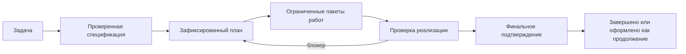

# Agent Lifecycle Kit

Agent Lifecycle Kit помогает довести работу агента от постановки задачи до
финального подтверждения результата. Ядро не привязано к конкретному провайдеру:
оно задаёт жизненный цикл, а адаптеры связывают этот цикл с конкретными CLI и
плагинами.

Главная цель проекта — закрывать задачу полностью, с максимально возможным
качеством для выбранной модели, и при этом держать под контролем расход токенов
на саму работу, проверки и координацию.



## Что входит

- Спецификация и план проверяются до начала реализации.
- Работа разбивается на пакеты с владельцем, границами записи и критериями
  приёмки.
- Выполнение, блокировки, повторные попытки и финальное подтверждение
  фиксируются в структурированных артефактах.
- Контракты адаптеров не смешивают детали конкретного хоста с ядром.
- Маленькие локальные модели получают компактный контекст и явный следующий
  шаг вместо длинной истории.
- Отчёты о расходе разделяют практическую работу, проверку продукта, контроль
  жизненного цикла и координацию.
- Экспорт использования показывает сессии, токены, ресурсы, digest
  подтверждений и необязательный `cost_usd`, если его сообщает metered-хост.
- Дополнительный proof-integrity слой для багфиксов и рискованных финальных
  подтверждений: стабильные findings, digest root cause, fix-impact receipts и
  hash chain.
- Дополнительные sandbox receipts для рискованных задач: filesystem, network,
  process, environment и enforcement source фиксируются отдельно от git
  write-scope.
- Import mapper profiles для Constitution/ADR и AGENTS/agentskills; результат
  остаётся untrusted draft с digest dialect profile.
- Лёгкий episode retrieval по receipt/session summaries с digest provenance и
  явным состоянием `chainVerified` или `chainUnchecked`.
- Runner recovery receipts для snapshot, restore, abandon, selected attempt,
  worker lease и heartbeat state.
- Optional cross-check profile для рискованных задач: выключен по умолчанию,
  capped в tokens/resources и advisory, пока план явно не делает его blocking.
- Phase resource measurements используют usage export envelope для токенов,
  длительности и resource counters без обязательного USD-cost.
- Рекомендации по режиму жизненного цикла строятся по накопленной статистике.
- Предложения по настройке правил остаются рекомендательными и применяются
  только явно, с возможностью отката.
- Диагностика готовности по умолчанию не пишет файлы и не запускает реальные
  модельные вызовы.

## Быстрый старт

Из исходного дерева:

```bash
python -m pip install -e .
agent-lifecycle version
agent-lifecycle diagnose --no-install-plans
agent-lifecycle adapter validate --descriptor adapters/codex/adapter.descriptor.json
```

Пошаговый пример: [Быстрый старт](quickstart.md).

## Обычный цикл

1. Уточнить задачу и ограничения.
2. Подготовить спецификацию и план.
3. Проверить план и зафиксировать его.
4. Выполнить ограниченные пакеты работ.
5. Проверить реализацию по плану.
6. Завершить задачу только после приёмки, подтверждающих артефактов и оценки
   остаточных рисков.

Основные группы команд:

- `agent-lifecycle specification`: проверка спецификации.
- `agent-lifecycle plan`: проверка плана, файл блокировки, снимки и передача
  контекста.
- `agent-lifecycle workflow`: отчёты о выполнении задач и финальное
  подтверждение.
- `agent-lifecycle audit`: проверка плана и реализации.
- `agent-lifecycle metrics`: отчёты о расходе, экспорт использования и
  проверка этих отчётов.
- `agent-lifecycle policy`: предложения по настройке правил жизненного цикла.
- `agent-lifecycle diagnostics`: обезличенные диагностические пакеты.
- `agent-lifecycle diagnose`: проверка готовности исходного дерева без записи и
  без реальных вызовов моделей.
- `agent-lifecycle adapter`: проверка, осмотр, заготовка адаптера, события и
  пробный план установки.

Подробности: [Справочник команд](reference/cli.md) и
[источник правды](reference/source-of-truth.md).

## Зрелость адаптеров

`EXPERIMENTAL` означает, что адаптер описан в исходниках и проходит
повторяемые проверки без реального запуска, но продвижение не заявлено. Для
`VERIFIED` нужны ограниченная проверка на реальном хосте, калибровки расхода,
принятое обезличенное резюме подтверждений и финальное подтверждение
жизненного цикла для проверенного диапазона версий.

| Хост | Текущее заявление |
| --- | --- |
| Codex | `VERIFIED` для Codex CLI 0.145.0. Одобрение публичного каталога плагинов не заявлено. |
| Claude Code | `VERIFIED` для Claude Code 2.1.220. Одобрение официального каталога не заявлено. |
| OpenCode | `VERIFIED` для OpenCode CLI 1.18.9. Публикация в npm не заявлена. |
| Hermes | `VERIFIED` для Hermes Agent v0.19.0. Одобрение публичного каталога не заявлено. |
| Qwen Code | `VERIFIED` для Qwen Code 0.21.0 на проверенной связке GLM 5.2. Одобрение публичного пакета не заявлено. |
| Cursor | `EXPERIMENTAL`; безопасный локальный осмотр прошёл, но подтверждений из реального запуска недостаточно. |
| Gemini CLI | `EXPERIMENTAL`; локальная проверка на реальном вызове ограничена текущим уровнем Gemini Code Assist. |
| Kimi Code | `EXPERIMENTAL`; для проверки нужен настроенный провайдер и псевдоним модели. |
| Grok Build | `EXPERIMENTAL`; использование ACP закрыто локальным probe gate, негативный probe фиксируется fail-closed. |
| OpenInterpreter | `EXPERIMENTAL`; host-local compatible CLI projection с offline conformance. |
| Pi | `EXPERIMENTAL`; RPC/JSON и AGENTS/agentskills projection без заявления о live promotion. |

Подробнее: [Установка адаптеров](adapters/install.md) и
[матрица поддержки адаптеров](adapters/support-matrix.md).

## Карта контрактов

Публичная поверхность жизненного цикла описана схемами. Полный список stable
schema ids, правила совместимости, runner recovery receipts, cross-check
contracts и usage export details находятся в
[Публичных контрактах](reference/public-contracts.md).
Compact vocabulary: `completionCheck`,
`agent-completion-check-receipt.v1`, `agent-goal-record.v1`,
`agent-objective-snapshot.v1`, `agent-runner-state.v1`,
`agent-runner-snapshot.v1`, `agent-follow-up-register.v1`,
`agent-follow-up-summary.v1`, `agent-worktree-isolation-policy.v1`,
`agent-worktree-attempt-receipt.v1`,
`agent-adapter-event-stream-receipt.v1`,
`agent-adapter-event-capture-validation.v1`, `agent-review-verdict.v1`,
`agent-review-routing-summary.v1`, `agent-optional-quality-pack.v1`,
`agent-behavior-check-run.v1`, `agent-diagnostic-bundle.v1` и
`agent-readonly-status-view.v1`.

## Границы проекта

- Ядро остаётся нейтральным к провайдерам. Команды конкретного хоста и выбор
  модели живут в адаптерах или локальных профилях.
- Маленькие модели получают компактные пакеты, детерминированные проверки и
  явные следующие действия.
- Большие модели проходят те же обязательные проверки качества; более сильное
  рассуждение не заменяет подтверждающие артефакты.
- Пробный запуск, заготовка, осмотр или синтетический прогон не повышают
  зрелость адаптера.
- Публичные заявления релиза опираются только на отслеживаемые файлы и
  обезличенные резюме подтверждений.
- Git write-scope ограничивает пути репозитория; sandbox receipts описывают
  runtime containment и могут оставаться `UNKNOWN` до отдельной проверки.
- Внешние dialect imports и retrieved episodes помогают с контекстом, но не
  заменяют проверенные ALK source-of-truth artifacts.
- Optional cross-check и runner recovery receipts добавляют evidence только
  при запросе задачи или плана; это не default multi-model execution.

## Документы

- [Быстрый старт](quickstart.md)
- [Установка адаптеров](adapters/install.md)
- [Матрица поддержки адаптеров](adapters/support-matrix.md)
- [Справочник команд](reference/cli.md)
- [Источник правды](reference/source-of-truth.md)
- [Публичные контракты](reference/public-contracts.md)
- [Диагностика готовности](reference/readiness-diagnostics.md)
- [Учёт расхода жизненного цикла](reference/lifecycle-cost.md)
- [Экспорт использования](reference/usage-export.md)
- [Целостность подтверждений](reference/evidence-integrity.md)
- [Sandbox boundaries](reference/sandbox-boundaries.md)
- [Import mappers](reference/import-mappers.md)
- [Episode retrieval](reference/episode-retrieval.md)
- [Runner recovery](reference/runner-recovery.md)
- [Cross-check profile](reference/cross-check-profile.md)
- [Безопасность релиза](security/release-security.md)

## Лицензия

Apache-2.0. Текст лицензии находится в корне репозитория.
