# Архитектура системы

Этот документ объясняет назначение, границы ответственности и внутреннее
устройство Agent Lifecycle Kit (ALK). ALK управляет завершением работы кодовых
агентов и не зависит от конкретного провайдера модели. Документ последовательно
переходит от задачи проекта к конкретным маршрутам вызова:

- C0 описывает миссию и границы ответственности.
- C1 показывает ALK во внешнем окружении.
- C2 делит проект на крупные исходные и рабочие части.
- C3 показывает компоненты внутри пакета выполнения.
- C4 называет основные маршруты вызова на уровне кода.

Уровни нужно читать по порядку. C0 отвечает на вопрос, зачем существует ALK;
C1 показывает участников и внешние границы; C2 описывает крупные части
поставки; C3 связывает доменные компоненты; C4 показывает, какие модули
вызываются в конкретных сценариях. Подробная англоязычная карта модулей
находится в файле `docs/architecture/modular-controller.md`.

## C0: контекст миссии

ALK решает задачу управления завершением работы внешнего кодового агента.
Основная проблема состоит не только в получении правки: на длинной или
рискованной задаче легко потерять исходную цель, выйти за разрешённые границы,
пропустить обязательную проверку или принять результат без достаточных
доказательств. ALK сохраняет согласованность запроса, проверенного плана,
состояния выполнения, подтверждений и решений о приёмке до доказанного
завершения или явной блокировки.

Сам ALK не исследует предметную область, не пишет продуктовый код и не заменяет
среду выполнения модели. Эту работу выполняют Codex, Claude Code, OpenCode или
другой внешний агент. ALK предоставляет контракты, переходы состояния,
контрольные точки и проверяемые артефакты вокруг этой работы.

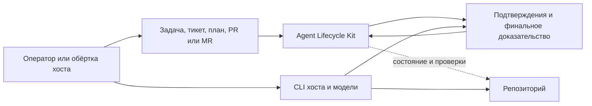

Архитектура строится на явном разделении полномочий:

- ALK владеет источником правды жизненного цикла: спецификацией, планом,
  состоянием, подтверждениями, контрольными точками и финальным доказательством.
- Репозиторий владеет исходным кодом, тестами, документацией и метаданными
  релиза.
- Адаптеры владеют проекцией команд хоста, границами окружения и локальными
  профилями запуска.
- Хосты владеют выполнением модели и учётными данными провайдера.
- Проверяющие отвечают за смысловую оценку. ALK фиксирует происхождение и
  проверяет структуру подтверждений этой оценки.

Такое разделение не позволяет истории переписки, установленному плагину или
одному успешному тесту незаметно заменить утверждённый план и решение о
приёмке.

## Распределение ответственности: ALK, хост, модель и репозиторий

Участники образуют единый процесс, но обладают разными полномочиями:

| Участник | Вклад в работу | Долговечный результат |
| --- | --- | --- |
| Ядро ALK | Классифицирует вход, проверяет контракты, переводит состояние и применяет контрольные точки. | Планы, lock-файлы, переходы состояния, подтверждения и финальное доказательство. |
| CLI хоста и адаптер | Предоставляет интерфейс пользователя, проекцию команд и локальную среду хоста. | Подтверждения адаптера, сведения о границе хоста и выбранный запуск модели. |
| Модель | Исследует задачу, объясняет варианты, предлагает план и через инструменты хоста изменяет или проверяет код. | Исследование, содержание плана, изменения реализации и замечания ревью. |
| Репозиторий | Хранит исходный код, тесты, документацию, пакеты планов и метаданные релиза. | Долговременная история проекта, с которой сравнивается задача. |
| Оператор или независимый проверяющий | Утверждает область работы, разрешает вопросы и оценивает смысловой результат. | Решения ревью и разрешение на следующий этап цикла. |

Модель предоставляет рассуждения и содержание. ALK задаёт структуру, которая
делает этот результат проверяемым: идентичность, область работы, владение,
проверки, подтверждения и решение. Хост является средой выполнения,
репозиторий — долговременным контекстом проекта, а ALK связывает их
типизированными артефактами.

## Как формируется цепочка гарантий

Результат принимается через последовательность связанных артефактов:

1. **Подтверждение входа** фиксирует текст задачи, файл или импортированный
   контекст и его отпечаток.
2. **Спецификация и план** определяют ожидаемый результат, ограничения,
   критерии приёмки, рабочие потоки, разрешённые файлы, бюджеты и маршруты
   подтверждений.
3. **Независимая проверка плана** оценивает полноту, ссылки, владение,
   безопасность и выбранную глубину процесса.
4. **Зафиксированные манифест и lock-файл** связывают проверенный план с одной
   неизменной идентичностью реализации.
5. **Подтверждения задачи и проверок** показывают выполненную работу,
   запущенные проверки, изменённые файлы, расход ресурсов и нерешённые действия.
6. **Аудит реализации** сравнивает результат с зафиксированным планом и
   подтверждениями его критериев приёмки.
7. **Финальное доказательство** объединяет принятые подтверждения и передаёт
   итоговый статус оператору и процессу выпуска.

Видимые статусы подсказывают следующее действие: `PASS` означает, что нужные
подтверждения приняты, `REVIEW_REQUIRED` указывает на недостающее решение или
проверку, а `BLOCKED` сохраняет причину, которая не позволяет перейти дальше.
К принятым артефактам жизненного цикла относятся проверенные план и lock-файл,
подтверждения состояния и задачи, сводки проверок и доказательств, независимые
аудиты плана и реализации и финальное доказательство. Review Mesh, Bug
Forensics, отчёты о прогрессе и подтверждения расхода ресурсов добавляются,
когда этого требует задача или план.

Граница гарантий задана явно:

| Класс подтверждения | Что ALK проверяет детерминированно | Что по-прежнему требует подтверждений по задаче |
| --- | --- | --- |
| Контракт и процесс | Форму схем, отпечатки, владение, разрешённые пути, переходы состояния, обязательные команды и происхождение подтверждений. | Насколько выбранные требования описывают нужный результат продукта. |
| Код и поведение | Результаты тестов, вывод проверок, область изменённых файлов, лимиты ресурсов и полноту аудита. | Смысловую корректность исследования, решения и реализации; план должен требовать тесты, ревью или предметные подтверждения. |
| Хост и модель | Идентичность адаптера, заявленные возможности, границу окружения и подтверждённый расход. | Качество рассуждений модели и поведение инструментов, предоставленных хостом. |

## C1: системный контекст

На системном уровне ALK представляет собой устанавливаемый Python-пакет и
локальную команду `agent-lifecycle`. Его можно использовать из опубликованного
пакета или непосредственно из исходного дерева. ALK читает и записывает
структурированные артефакты, но не требует отдельного сервера, фонового
процесса, базы данных или прямого API провайдера модели.

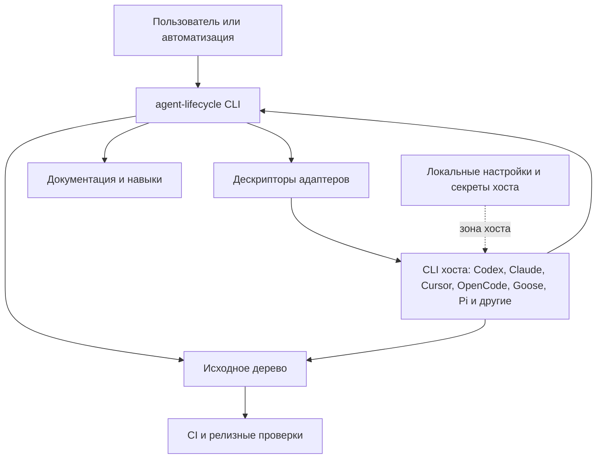

Из системного контекста следуют четыре обязательные границы:

- Переносимые артефакты не должны хранить сырые секреты, приватные значения
  окружения или локальные абсолютные пути.
- `adapter task start` принимает обычный текст или Markdown только как
  черновой вход.
- Управляемое выполнение требует зафиксированный запрос запуска или
  зафиксированный план, связанный с состоянием рабочего цикла.
- При проверке несколькими моделями ИИ ALK готовит назначения, импортирует
  очищенные результаты, объединяет выводы и проверяет кворум, но запуск
  рецензентов остаётся ответственностью внешних хостов.

## C2: крупные части

Проект поставляется как Python-пакет вместе с адаптерами, документацией,
профилями и средствами релизной проверки. В этом разделе крупными частями
считаются области кода и данных, а не отдельные сетевые или контейнерные
службы.

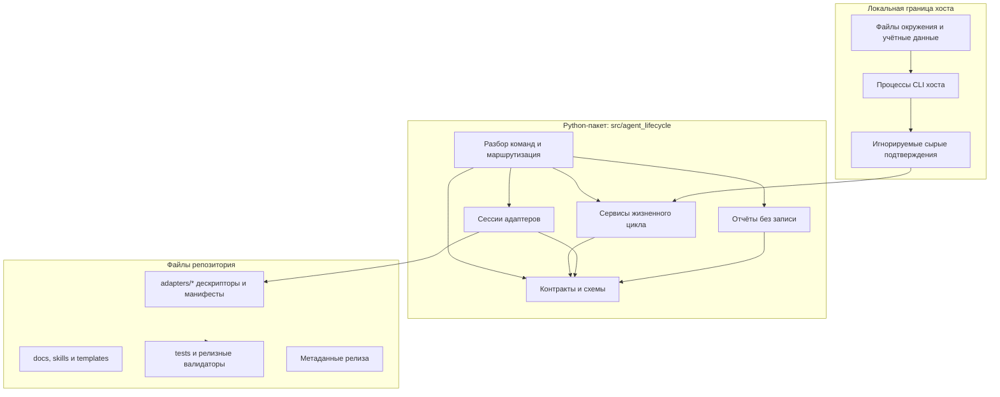

| Часть | Ответственность | Не должна делать |
| --- | --- | --- |
| `src/agent_lifecycle/cli` | Разобрать аргументы, направить команду, вывести стабильный JSON или текстовый прогресс. | Хранить смысл жизненного цикла или логику провайдера. |
| `src/agent_lifecycle/contracts` | Публичные схемы, канонический JSON, отпечатки, типовые ошибки и правила совместимости. | Зависеть от CLI хоста. |
| Доменные пакеты | Планирование, рабочий цикл, аудит, контекст, метрики, качество, проверка несколькими моделями ИИ и отчёты. | Напрямую вызывать API провайдера. |
| `src/agent_lifecycle/adapter_sessions` | Сессии по дескрипторам, приём задачи и мост к управляемому запуску. | Вставлять промпты в хост или разбирать телеметрию хоста в ядре. |
| `adapters/*` | Дескрипторы хостов, проекции операций, манифесты поддержки и резюме подтверждений. | Менять схемы жизненного цикла. |
| `tools/release` и тесты | Релизные проверки, валидаторы, совместимость и документационные контрольные точки. | Устанавливать уровень поддержки реального хоста только по синтетическим данным. |

## C3: карта компонентов выполнения

Внутри Python-пакета команды направляются в доменные компоненты. Компоненты
зависят от общих контрактов, но не должны переносить особенности конкретного
хоста в ядро жизненного цикла. На схеме стрелка означает вызов или чтение
контракта, а не передачу полномочий на выполнение.

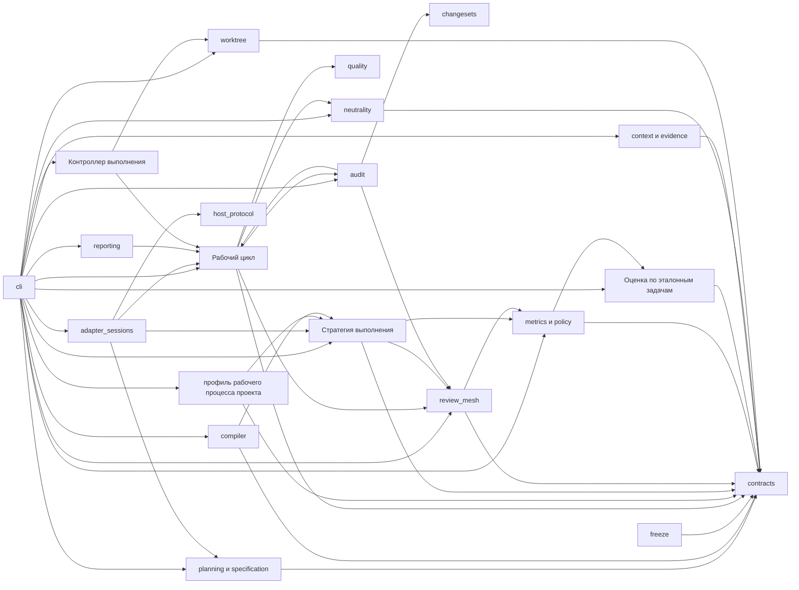

| Компонент | Основные модули | Когда вызывается |
| --- | --- | --- |
| Маршрутизация CLI | `cli/main.py`, `cli/parsers.py`, `cli/dispatch.py`, `cli/dispatch_adapters.py`, `cli/dispatch_contracts.py`, `cli/dispatch_lifecycle.py`, `cli/dispatch_observability.py`, `cli/dispatch_planning.py`, `cli/adapter.py` | Любая команда `agent-lifecycle ...` начинается здесь; корневой диспетчер выбирает специализированный обработчик группы команд. |
| Контракты | `contracts/*` | Все публичные подтверждения, схемы, отпечатки и проверочные конверты. |
| Поиск изменений | `changesets/git.py` | Аудит владения и реализации по Git-изменениям. |
| Компиляция заданий | `compiler/task_packets.py`, `compiler/small_model_packets.py` | Преобразование зафиксированного графа задач в рабочие и компактные пакеты. |
| Планирование | `planning/*`, `specification/*`, `freeze/locks.py` | SDD-уровень, проверка плана, полнота, приёмка и файл блокировки. |
| Рабочий цикл | `workflow/*` | Изменение состояния, переходы задач, финализация и следующий управляемый шаг. |
| Сессии адаптеров | `adapter_sessions/*` | `adapter session`, `adapter task start`, `adapter run`, проверка локального профиля и явный запуск внешнего процесса из зафиксированного состояния. |
| Профиль рабочего процесса проекта | `project/profile.py`, `project/merge.py`, `project/guidance.py`, `cli/project.py` | `project profile init/check` и `start`, когда локальный профиль найден автоматически или выбран явно. |
| Протокол хоста | `host_protocol/*` | Проверка адаптера, безопасный осмотр, захват событий и возможности. |
| Необязательный мост тредов | `host_protocol/thread_bridge.py`, `policy/thread_bridge.py`, `context/thread_bridge_context.py` | Подготовка и проверка запросов к тредам хоста, импорт ограниченного контекста и передача его в поиск или Review Mesh. Нативные операции остаются в адаптере. |
| Аудит | `audit/*` | Владение файлами, вердикты проверки, аудит реализации, целостность доказательств. |
| Групповая проверка | `review_mesh/*` | Рекомендация, шаблоны оператора, подготовка пакетов проверяющих, назначения, импорт результатов, объединение выводов и кворум. |
| Отчёты | `reporting/*` | Статус, лента событий, прогресс, счётчик изменений и мост прогресса. |
| Метрики и правила | `metrics/*`, `policy/*`, `model_routing/*` | Экспорт расхода, политика токенов/ресурсов, локальная статистика и классы моделей. |
| Стратегия выполнения | `policy/execution_strategy.py`, `cli/strategy.py` | Объединение существующих решений по риску, качеству, классу модели, компактному пакету и проверке в один артефакт без записи. |
| Оценка по эталонным задачам | `benchmarks/*`, `contracts/benchmark_schemas.py`, `cli/benchmarks.py` | Детерминированное сравнение качества, ложных приёмок, повторов, времени и достоверности токенов без записи. |
| Контекст и подтверждения | `context/*`, `evidence_index/*`, `goal/*`, `followup/*` | Компактные пакеты, поиск по эпизодам, импорт внешнего контекста, представление цели и продолжения. |
| Нейтральность | `neutrality/scanner.py`, `neutrality/paths.py`, `neutrality/receipt.py`, `neutrality/gate.py` | Привязанная к индексу Git проверка выпуска, явное включение локальных подтверждений из разрешённых корней, устойчивое чтение, проверка полномочий и подписанные квитанции. |
| Контроллер выполнения | `runner/*` | Ограниченное состояние цикла выполнения поверх существующего рабочего цикла. |
| Рабочее дерево | `worktree/*`, `cli/worktree.py` | Правила изоляции рабочего дерева и подтверждения попыток. |

## C4: маршруты вызова на уровне кода

Уровень C4 связывает пользовательские команды с конкретными модулями. Каждый
маршрут ниже объясняет условие запуска, последовательность действий и границу
результата. Внутренние вспомогательные вызовы, которые не меняют понимание
сценария, намеренно не показаны.

### Маршрутизация команды

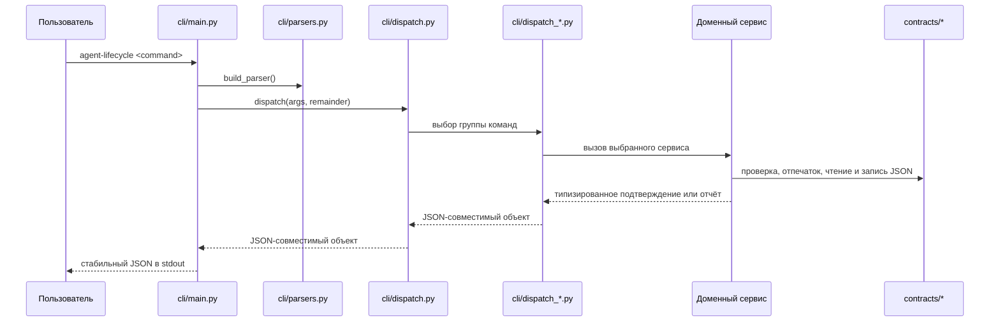

Здесь применяются диспетчер команд и функциональное ядро. Модуль
`cli/dispatch.py` выбирает единую команду запуска или обработчик одной из пяти
групп: адаптеры и готовность, контракты и подтверждения, жизненный цикл,
наблюдаемость либо планирование. Модули командной строки отвечают только за
аргументы, маршрутизацию и вывод. Правила предметной области и их тесты
находятся в доменных сервисах.

### Необязательный мост тредов

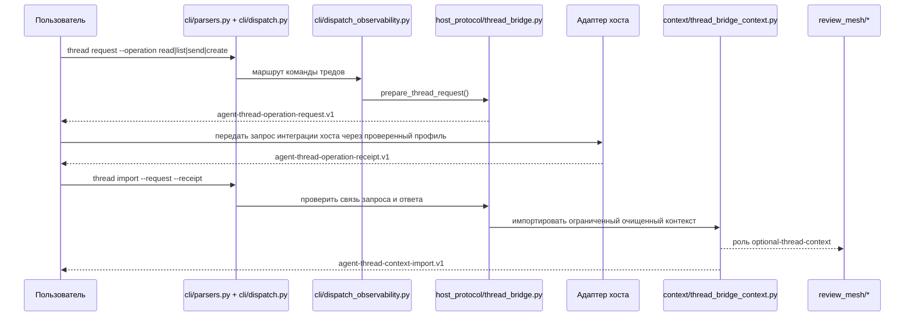

Мост является явным маршрутом обмена. Ядро подготавливает, проверяет и очищает
артефакты, а адаптер выполняет нативную операцию треда. Импортированное
содержимое остаётся внешним контекстом и не становится полномочием плана,
подтверждением приёмки или финальным доказательством.

### Квалификация возможности адаптера

В версии 1.66 появились профили и квалификационные квитанции в
`contracts/thread_bridge_schemas.py`. Модуль `host_protocol/capabilities.py`
переводит каждую операцию в существующие значения `capability_support` из
контракта `capability_support`. Статус дескриптора (`UNSUPPORTED`, `WRAPPER_ONLY` или
`SUPPORTED`) отделён от режима политики проекта. Значение `SUPPORTED`
появляется только после совпадения отпечатка дескриптора, идентификатора
capability-manifest, диапазона версий хоста, набора операций и версии
политики. `cli/adapter.py` предоставляет команды
`adapter thread-capability` и `adapter thread-qualify`; обе только читают
локальные артефакты и не запускают хост из ядра.

### Единая команда запуска жизненного цикла

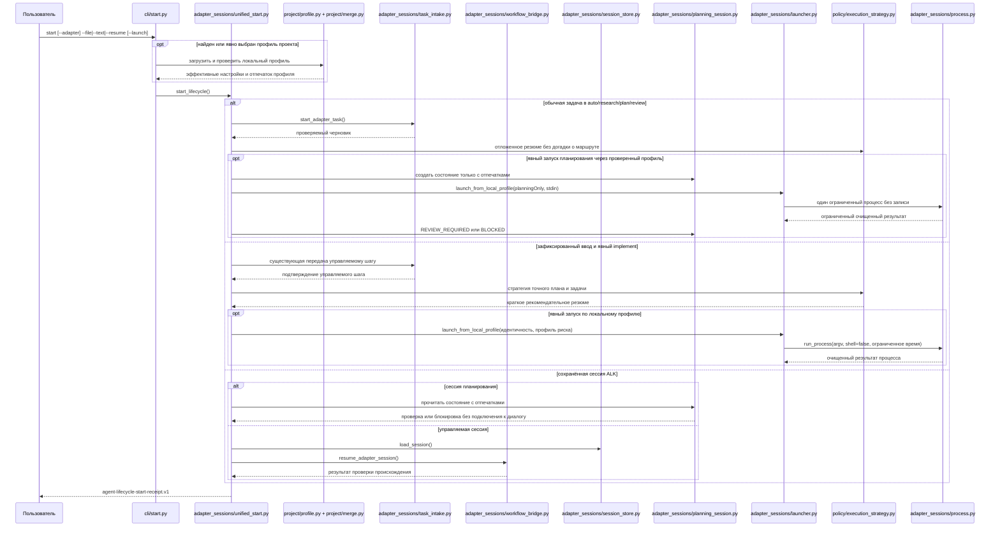

Команда `start` служит фасадом над существующими источниками полномочий и сама
не владеет переходами рабочего цикла. Если профиль проекта активен,
`cli/project.py` загружает его из текущего корня проекта, а `project/merge.py`
объединяет его настройки с зафиксированным планом и lock-файлом до вызова
`unified_start.py`. Отпечаток профиля передаётся в проекцию стратегии, а
исходное подтверждение запуска остаётся вложенным результатом. Внешний
результат этого маршрута имеет схему `agent-guided-action-receipt.v1`.

Режимы `auto`, `research`, `plan` и
`review` принимают обычную задачу только как черновик и не могут начать
реализацию. При явном `--launch` они могут обратиться лишь к отдельно
проверенному профилю `planningOnly`; такой процесс обязан завершиться
проверкой или блокировкой и не имеет права менять исходное дерево.

Режим `implement` принимает только зафиксированный вход с полной привязкой к
плану, файлу блокировки, состоянию, задаче, операции и ревизии. Возобновление
работает с идентификатором состояния ALK и не пытается угадать идентификатор
диалога внешнего инструмента. Общий запуск только по дескриптору и запуск
неограниченной интерактивной сессии остаются заблокированными.

### Стратегия выполнения и сравнение

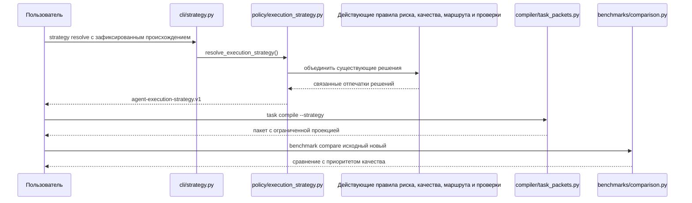

Стратегия выполнения и эталонное сравнение детерминированы и не меняют
состояние рабочего цикла. Стратегия не может понизить обязательную нижнюю
границу качества, а защищённая задача S2 не направляется в компактный пакет.
Сравнение сначала проверяет качество, ложные приёмки и происхождение эталона и
только после этого оценивает расход. Автоматическое принятие улучшения возможно
лишь при подтверждённой экономии, отсутствии ухудшения ресурсов и полном наборе
измерений.

### Приём обычной задачи или Markdown

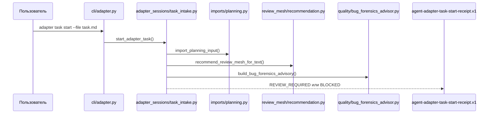

Маршрут приёма используется для обычного текста задачи, Markdown-файлов,
пакетов проверки кода и импортированных материалов планирования. Он никогда не
запускает реализацию. Подтверждение хранит тип источника, его отпечаток и размер
в байтах, но не копирует исходный текст. Рекомендации проверки несколькими
рецензентами и расследования ошибок остаются подсказками, пока проверенный и
зафиксированный план не объявит соответствующие контрольные точки
обязательными.

### Управляемый запуск адаптера

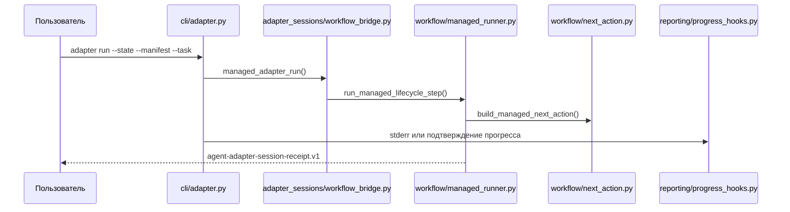

Управляемый маршрут доступен только для зафиксированного плана, связанного с
текущим состоянием рабочего цикла. ALK проверяет происхождение и возвращает
следующее допустимое действие. Саму модель по-прежнему запускает внешний хост,
поэтому подтверждение следующего шага не следует трактовать как выполненную
работу.

### Изменение состояния рабочего цикла

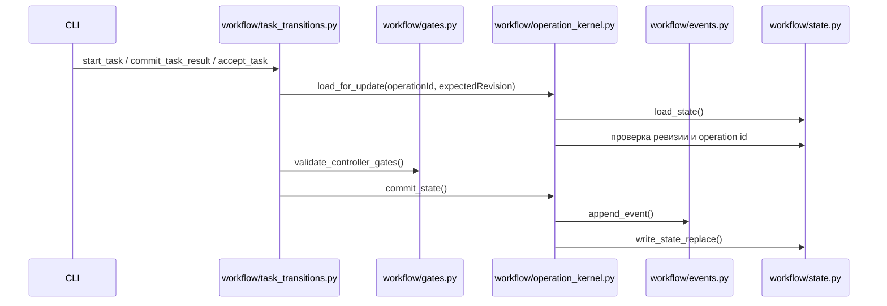

Изменение состояния реализовано как конечный автомат с единым ядром операции,
оптимистичной проверкой ревизии, ключом идемпотентности и добавляемым журналом
событий. Команда отклоняется до записи, если ревизия устарела, идентификатор
операции уже использован или обязательное подтверждение отсутствует.

### Проверка изменений GitHub или GitLab

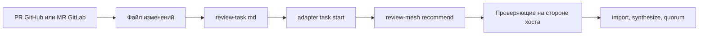

Для проверки локальной ветки или запроса на слияние оператор сначала получает
изменения средствами Git и формирует устойчивый пакет проверки. ALK принимает
этот пакет, фиксирует границы и при необходимости координирует рецензентов.
Получение ветки, публикация замечаний и слияние остаются внешними действиями.

### Проверка несколькими моделями ИИ

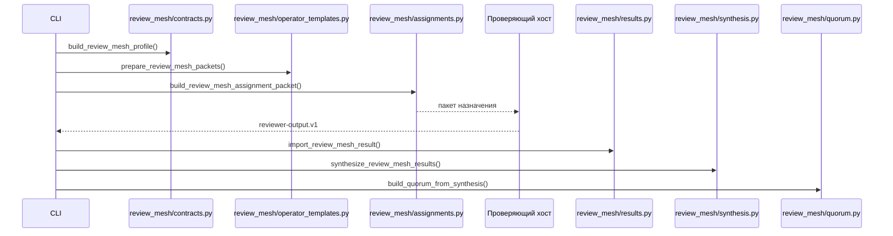

Проверка несколькими моделями ИИ применяется к черновику ведущего,
параллельному исследованию или аудиту реализации. ALK создаёт пакеты заданий и
проверяет импортированные результаты, но не запускает модели. Кворум
становится обязательным только для тех этапов, которые прямо названы в
зафиксированном плане.

### Аудит реализации

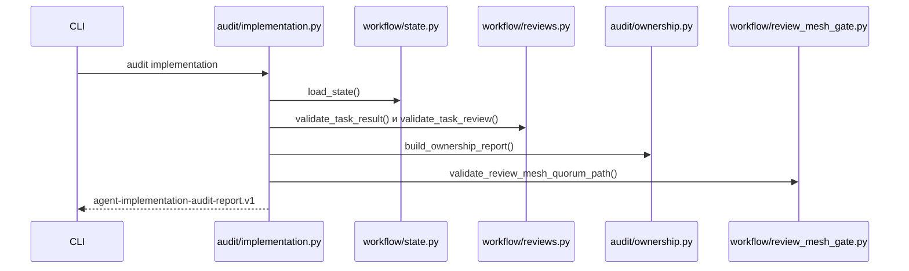

Аудит реализации выполняется после попытки, когда уже существуют результат
задачи и независимая рецензия. Он сопоставляет их с зафиксированным планом,
проверяет происхождение, владение файлами, критерии приёмки, ограничения среды,
подтверждения и, если требуется, кворум нескольких рецензентов. Успешные тесты
без соответствия плану не дают автоматического положительного вердикта.

### Сводная проверка пакета

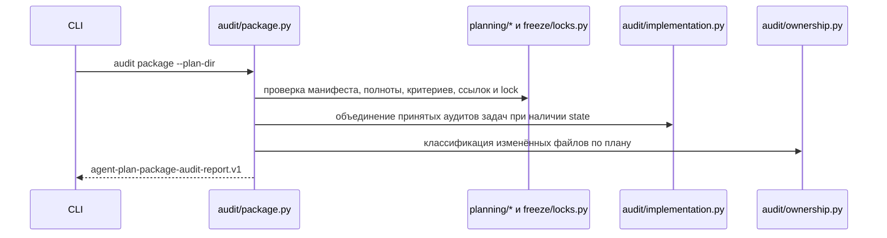

Этот маршрут используется при передаче плана и готовой реализации другому
проверяющему. Он объединяет существующие проверки и возвращает `PASS`,
`REVIEW_REQUIRED` или `FAIL`, не меняя состояние рабочего цикла и не запуская
внешние инструменты.

### Прогресс и отчёты без записи

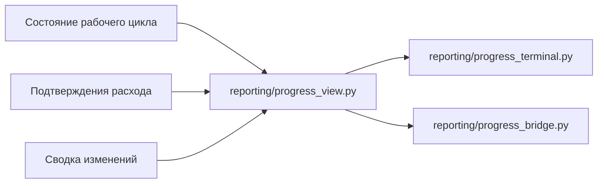

Команды `report progress`, `report progress-bridge` и хуки управляемых переходов
строят представление из уже существующего состояния и переданных подтверждений
расхода. Они не меняют состояние, не запускают модель и не разбирают
телеметрию конкретного хоста внутри ядра.

### Проверка нейтральности выпуска

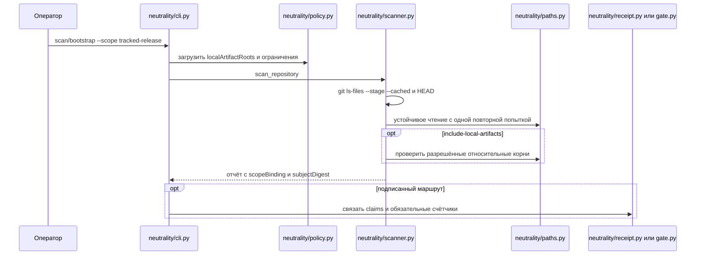

Релизная проверка использует область `tracked-release`, связанную с индексом
Git, и по умолчанию не читает локальные материалы. Отдельный шаг может явно
добавить только корни, разрешённые политикой. Устаревшие режимы обхода
сохраняются для совместимости, но их использование фиксируется в подписанном
артефакте.

## Варианты работы и маршрутизация вызовов

| Вариант | Команда оператора | Основные модули | Результат |
| --- | --- | --- | --- |
| Проверка готовности | `diagnose --no-install-plans` | `diagnostics/readiness.py`, `host_protocol/*`, `context/*` | Очищенный отчёт готовности. |
| Проверка адаптера | `adapter validate/inspect/install-plan` | `cli/adapter.py`, `host_protocol/*`, `diagnostics/readiness.py` | Проверка, безопасный осмотр или пробный план установки. |
| Приём обычной задачи | `adapter task start --file/--text` | `adapter_sessions/task_intake.py`, `imports/planning.py`, `review_mesh/recommendation.py`, `quality/bug_forensics_advisor.py` | Черновое подтверждение, требующее проверки. |
| Запуск по профилю проекта | `project profile init/check`, `start --project-profile` или найденный `.alk/project-profile.json` | `cli/project.py`, `project/profile.py`, `project/merge.py`, `adapter_sessions/unified_start.py` | Эффективный профиль и подтверждение управляемого действия; полномочия плана и lock-файла сохраняются. |
| Проверка плана | `plan check`, `plan completeness-check`, `plan acceptance-check` | `planning/*`, `freeze/locks.py` | PASS/FAIL подтверждение плана. |
| Управляемый следующий шаг | `workflow run` или `adapter run` | `workflow/managed_runner.py`, `workflow/next_action.py`, `adapter_sessions/workflow_bridge.py` | Подтверждение следующего шага без запуска хоста. |
| Изменение задачи | `workflow task-start/task-result/task-accept` | `workflow/task_transitions.py`, `workflow/operation_kernel.py`, `workflow/gates.py` | Обновлённое состояние и журнал событий. |
| Аудит реализации | `audit implementation` | `audit/implementation.py`, `audit/ownership.py`, `workflow/reviews.py` | Отчёт аудита реализации. |
| Сводная проверка пакета | `audit package --plan-dir` | `audit/package.py`, `planning/*`, `freeze/locks.py`, `audit/implementation.py`, `audit/ownership.py` | Отчёт передачи плана и реализации. |
| Групповая проверка | `review-mesh profile/recommend/prepare/assign/import-result/synthesize/quorum` | `review_mesh/*`, `model_routing/profiles.py`, `quality/cross_check.py` | Рекомендация, подготовленные пакеты проверяющих, назначения, результаты, объединение выводов и кворум. |
| Проверка кода | Git/CLI хоста и `adapter task start` | Git вне ALK, затем `adapter_sessions/task_intake.py` и при необходимости `review_mesh/*` | Приём пакета проверки и необязательный кворум. |
| Исправление ошибки | `adapter task start` и контрольные точки зафиксированного плана | `adapter_sessions/task_intake.py`, `quality/bug_forensics_advisor.py`, `quality/bug_forensics.py`, `audit/bug_forensics.py`, `workflow/bug_forensics_gates.py` | Рекомендация профиля расследования, затем обязательные подтверждения по плану. |
| Внешний контекст | `context external-import` и поиск по эпизодам | `context/external_memory.py`, `evidence_index/external_context.py`, `evidence_index/episode_index.py` | Необязательные подсказки контекста без права заменять доказательства. |
| Тредовый контекст | `thread request` и `thread import` | `host_protocol/thread_bridge.py`, `policy/thread_bridge.py`, `context/thread_bridge_context.py`, при необходимости `review_mesh/*` | Ограниченный запрос, квитанция адаптера и дополнительный импорт контекста. |
| Квалификация возможности тредов | `adapter thread-capability`, `adapter thread-qualify` | `contracts/thread_bridge_schemas.py`, `host_protocol/capabilities.py`, `host_protocol/validation.py`, `adapters/*` | Объявление и результат квалификации, связанные с дескриптором; ядро не обращается к хосту. |
| Статус цели | `goal view` | `goal/view.py`, `reporting/progress_view.py`, `workflow/query.py` | Представление цели и прогресса без записи. |
| Стратегия выполнения | `strategy resolve`, затем при необходимости `task compile --strategy` | `policy/execution_strategy.py`, `cli/strategy.py`, `compiler/*` | Полный артефакт без записи и ограниченная проекция в пакет задачи. |
| Эталонное сравнение | `benchmark evaluate`, `benchmark compare` | `benchmarks/*`, `contracts/benchmark_schemas.py` | Детерминированная оценка или сравнение с приоритетом качества без вызова модели или внешнего инструмента. |
| Отображение прогресса | `report progress`, `report progress-bridge`, хуки прогресса | `reporting/*`, `cli/progress_hooks.py` | Текстовый или JSON-прогресс без вызова модели. |
| Проверка релиза | Релизные инструменты и тесты | `tools/release/*`, `contracts/release_contract_schemas.py`, docs/tests | Проверка исходного релиза и подтверждений. |

## Используемые паттерны

| Паттерн | Где используется | Зачем нужен |
| --- | --- | --- |
| Порты и адаптеры | `adapters/*`, `host_protocol/*`, `adapter_sessions/*` | Держать команды хоста, секреты и возможности вне ядра жизненного цикла. |
| Контракты сначала | `contracts/*`, `schemas.py`, публичные `.v1` подтверждения | Делать каждое заявление жизненного цикла машинно проверяемым и переносимым. |
| Диспетчер команд | `cli/main.py`, `cli/parsers.py`, `cli/dispatch.py`, `cli/dispatch_*.py` | Оставлять корневой CLI тонким и направлять каждую группу команд в её доменный обработчик. |
| Функциональное ядро и императивная оболочка | Функции создания и проверки возвращают словари; CLI работает с путями и выводом. | Упростить тестирование и чтение небольшими моделями. |
| Конечный автомат | `workflow/state.py`, `workflow/task_transitions.py`, `runner/core.py` | Сделать фазы жизненного цикла явными и отказывать при недопустимых переходах. |
| Ядро операции | `workflow/operation_kernel.py` | Централизовать проверку ревизии, идемпотентность и запись состояния/событий. |
| Цепочка контрольных точек | `workflow/gates.py`, контрольные точки аудита, завершения и кворума | Не принимать работу и не финализировать запуск без обязательных подтверждений. |
| Стратегия и политика | `policy/execution_strategy.py`, остальные `policy/*`, `model_routing/*`, `metrics/recommendations.py` | Объединять безопасные маршруты без дублирования нижележащих правил и без привязки к поставщику. |
| Фасад | `audit/implementation.py`, `diagnostics/bundles.py`, `reporting/*` | Собрать несколько проверок в один типизированный отчёт без дублирования нижних уровней. |
| Пара создания и проверки | Большинство контрактных модулей и релизных валидаторов | Детерминированно создать подтверждение и независимо его проверить. |
| Отказ при сомнении | Импорт, запуск адаптера, импорт результата проверки, релизные контрольные точки | Отказывать при небезопасном или неподтверждённом пути вместо догадок. |

## Архитектурные правила

- Смысл жизненного цикла находится в доменных пакетах, а не в адаптерах или
  отображении CLI.
- Адаптеры описывают возможности хоста и локальные границы запуска, но не
  владеют правдой рабочего цикла.
- Сырой вход никогда не является полномочием на выполнение.
- Рекомендация не является контрольной точкой. Контрольная точка появляется
  только после явного включения в зафиксированном плане.
- Представления без записи не меняют состояние и не запускают модель.
- Стратегия выполнения носит рекомендательный характер, сохраняет нижнюю
  границу качества и не выдаёт полномочий рабочего цикла или запуска хоста.
- Расход и прогресс используют токены и ресурсы; денежная стоимость
  необязательна и принимается только если её сообщает тарифицируемый хост.
- Публичные заявления релиза должны опираться на отслеживаемые резюме и, когда
  нужно, на локальные очищенные подтверждения реального хоста.

## Соразмерность процесса задаче

Архитектура не требует одинаковой глубины контроля для всех задач. Уровень S0
ограничивается одной задачей, одним исполнителем, точной областью записи и
одним способом проверки. S1 добавляет требования, критерии приёмки и
подтверждения для обычной продуктовой работы. Полный набор бюджетов, графов,
проверок безопасности и финального аудита относится к S2 и должен быть
обоснован архитектурным, эксплуатационным или внешним риском.

Локальные валидаторы, расчёт отпечатков и построение отчётов детерминированы и
не расходуют токены модели. Расход появляется у внешнего агента и рецензентов.
Модуль `metrics/costs.py` разделяет реализацию, проверку продукта, соблюдение
процесса и координацию, а режимы жизненного цикла задают ограничения для
`pipelineCompliance`.

Текущая проверка не объединяет координацию с соблюдением процесса в одну долю.
Следовательно, успешный отчёт подтверждает заявленные ограничения
`pipelineCompliance`, но не доказывает автоматически, что вся служебная работа
заняла меньше половины реального запуска. Для такого вывода нужны полные
подтверждённые данные хоста по этапам и совместная оценка обеих категорий.

Практическое правило состоит в том, что продуктовый результат и его проверка
должны оставаться основной работой. Если в задаче S0 или S1 преобладают
служебные действия, процесс следует упростить: убрать дублирующие проверки,
сократить необязательное число рецензентов, разделить слишком широкий план или
не применять ALK к небольшой одноразовой правке. Для S2 более высокий расход
допустим только как следствие подтверждённого риска, а не как самоцель.

## Связанные документы

- [Как ALK работает с разными задачами](../guides/how-alk-works.md)
- [Источник правды](../reference/source-of-truth.md)
- [Управляемые сессии адаптеров](../reference/managed-adapter-sessions.md)
- [Профиль рабочего процесса проекта](../reference/project-workflow-profile.md)
- [Аудит реализации](../reference/implementation-audit.md)
- [Проверка несколькими моделями ИИ](../review-mesh-workflow.md)
- [Сценарии проверки кода](../code-review-workflows.md)
- [Внешний контекст памяти](../reference/external-memory.md)
- [Непрерывность цели](../reference/goal-continuity.md)
- [Профиль расследования ошибок](../reference/bug-forensics.md)
- [Стратегия выполнения без снижения качества](../reference/execution-strategy.md)
- [Проверка нейтральности](../reference/neutrality.md)
- [Снимки контекста и восстановление после сжатия](../reference/context-checkpoints.md)

Дополнительные англоязычные архитектурные документы: `docs/architecture/release-architecture.md`,
`docs/architecture/runner-transition-contract.md` и
`docs/architecture/runner-extension-map.md`.
