# Архитектура системы

Этот документ описывает Agent Lifecycle Kit (ALK) как нейтральный к
провайдерам контроллер жизненного цикла для задач кодовых агентов. Структура
описания следует уровням C4 и добавляет уровень C0 для миссии проекта:

- C0 описывает миссию и границы ответственности.
- C1 показывает ALK во внешнем окружении.
- C2 делит проект на крупные исходные и рабочие части.
- C3 показывает компоненты внутри пакета выполнения.
- C4 называет основные маршруты вызова на уровне кода.

Подробная англоязычная карта модулей находится в
`docs/architecture/modular-controller.md`. Этот документ объясняет, как части
системы взаимодействуют в рабочих сценариях.

## C0: контекст миссии

ALK нужен, чтобы провести задачу от запроса до проверяемого завершения и при
этом не превратить ядро жизненного цикла в ещё одну среду выполнения кодового
агента. ALK задаёт контракты, переходы состояния, контрольные точки и
подтверждения. Хостовые CLI по-прежнему выполняют модельную работу,
редактирование и инструменты.

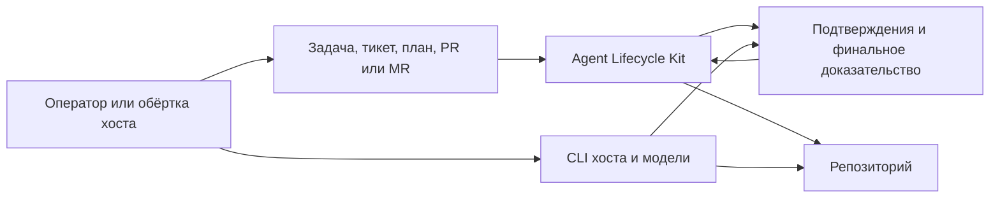

Главное архитектурное правило - разделение полномочий:

- ALK владеет источником правды жизненного цикла: спецификацией, планом,
  состоянием, подтверждениями, контрольными точками и финальным доказательством.
- Репозиторий владеет исходным кодом, тестами, документацией и метаданными
  релиза.
- Адаптеры владеют проекцией команд хоста, границами окружения и локальными
  профилями запуска.
- Хосты владеют выполнением модели и учётными данными провайдера.
- Проверяющие владеют смысловой оценкой; ALK фиксирует и проверяет
  подтверждения этой оценки.

## C1: системный контекст

На системном уровне ALK - это локальная CLI-команда и Python-пакет внутри
исходного дерева. Он читает и записывает структурированные артефакты, но не
требует сервера, фонового процесса, базы данных или API провайдера.

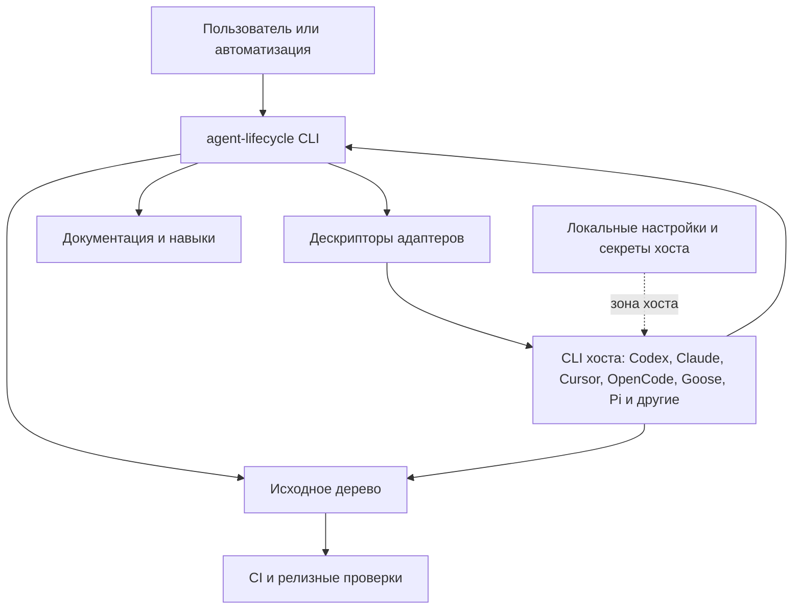

Важные границы:

- Переносимые артефакты не должны хранить сырые секреты, приватные значения
  окружения или локальные абсолютные пути.
- `adapter task start` принимает обычный текст или Markdown только как
  черновой вход.
- Управляемое выполнение требует зафиксированный запрос запуска или
  зафиксированный план, связанный с состоянием рабочего цикла.
- Дополнительная групповая проверка остаётся хостовой: ALK готовит назначения,
  импортирует очищенные результаты, объединяет выводы и проверяет кворум.

## C2: крупные части

Проект поставляется как исходный код. В этом разделе "части" означают исходные
и рабочие области, а не Docker-сервисы.

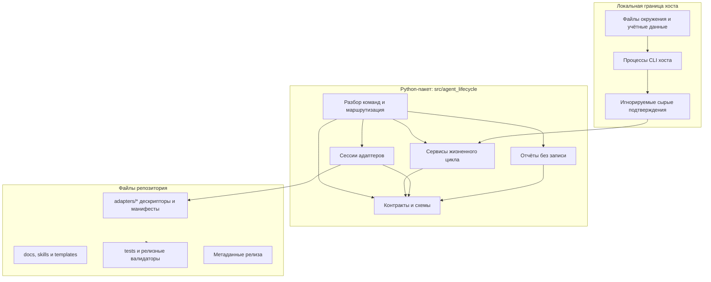

| Часть | Ответственность | Не должна делать |
| --- | --- | --- |
| `src/agent_lifecycle/cli` | Разобрать аргументы, направить команду, вывести стабильный JSON или текстовый прогресс. | Хранить смысл жизненного цикла или логику провайдера. |
| `src/agent_lifecycle/contracts` | Публичные схемы, канонический JSON, отпечатки, типовые ошибки и правила совместимости. | Зависеть от CLI хоста. |
| Доменные пакеты | Планирование, рабочий цикл, аудит, контекст, метрики, качество, групповая проверка и отчёты. | Напрямую вызывать API провайдера. |
| `src/agent_lifecycle/adapter_sessions` | Сессии по дескрипторам, приём задачи и мост к управляемому запуску. | Вставлять промпты в хост или разбирать телеметрию хоста в ядре. |
| `adapters/*` | Дескрипторы хостов, проекции операций, манифесты поддержки и резюме подтверждений. | Менять схемы жизненного цикла. |
| `tools/release` и тесты | Релизные проверки, валидаторы, совместимость и документационные контрольные точки. | Повышать зрелость адаптера по синтетическим данным. |

## C3: карта компонентов выполнения

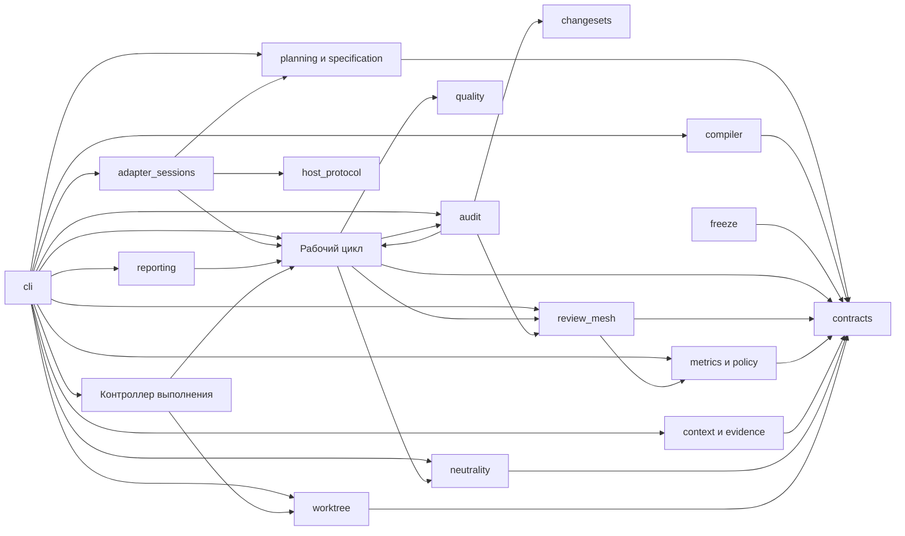

| Компонент | Основные модули | Когда вызывается |
| --- | --- | --- |
| Маршрутизация CLI | `cli/main.py`, `cli/parsers.py`, `cli/dispatch.py`, `cli/dispatch_adapters.py`, `cli/dispatch_contracts.py`, `cli/dispatch_lifecycle.py`, `cli/dispatch_observability.py`, `cli/dispatch_planning.py`, `cli/adapter.py` | Любая команда `agent-lifecycle ...` начинается здесь; корневой диспетчер выбирает специализированный обработчик группы команд. |
| Контракты | `contracts/*` | Все публичные подтверждения, схемы, отпечатки и проверочные конверты. |
| Поиск изменений | `changesets/git.py` | Аудит владения и реализации по Git-изменениям. |
| Компиляция заданий | `compiler/task_packets.py`, `compiler/small_model_packets.py` | Преобразование зафиксированного графа задач в рабочие и компактные пакеты. |
| Планирование | `planning/*`, `specification/*`, `freeze/locks.py` | SDD-уровень, проверка плана, полнота, приёмка и файл блокировки. |
| Рабочий цикл | `workflow/*` | Изменение состояния, переходы задач, финализация и следующий управляемый шаг. |
| Сессии адаптеров | `adapter_sessions/*` | `adapter session`, `adapter task start`, `adapter run`, проверка локального профиля и явный запуск внешнего процесса из зафиксированного состояния. |
| Протокол хоста | `host_protocol/*` | Проверка адаптера, безопасный осмотр, захват событий и возможности. |
| Аудит | `audit/*` | Владение файлами, вердикты проверки, аудит реализации, целостность доказательств. |
| Групповая проверка | `review_mesh/*` | Рекомендация, шаблоны оператора, подготовка пакетов проверяющих, назначения, импорт результатов, объединение выводов и кворум. |
| Отчёты | `reporting/*` | Статус, лента событий, прогресс, счётчик изменений и мост прогресса. |
| Метрики и правила | `metrics/*`, `policy/*`, `model_routing/*` | Экспорт расхода, политика токенов/ресурсов, локальная статистика и классы моделей. |
| Контекст и подтверждения | `context/*`, `evidence_index/*`, `goal/*`, `followup/*` | Компактные пакеты, поиск по эпизодам, импорт внешнего контекста, представление цели и продолжения. |
| Нейтральность | `neutrality/scanner.py`, `neutrality/paths.py`, `neutrality/receipt.py`, `neutrality/gate.py` | Привязанная к индексу Git проверка выпуска, явное включение локальных подтверждений из разрешённых корней, устойчивое чтение, проверка полномочий и подписанные квитанции. |
| Контроллер выполнения | `runner/*` | Ограниченное состояние цикла выполнения поверх существующего рабочего цикла. |
| Рабочее дерево | `worktree/*`, `cli/worktree.py` | Правила изоляции рабочего дерева и подтверждения попыток. |

## C4: маршруты вызова на уровне кода

Уровень C4 ниже называет конкретные функции и модули. Он ограничен теми
маршрутами, которые реально использует оператор.

### Маршрутизация команды

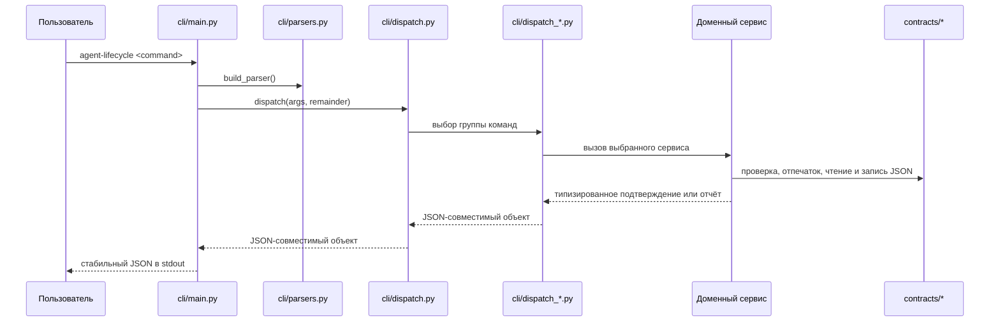

Паттерн: диспетчер команд и функциональное ядро. `cli/dispatch.py` выбирает
единую команду запуска или один из пяти обработчиков групп: адаптеры и
готовность, контракты и подтверждения, жизненный цикл, наблюдаемость или
планирование. Модули командной строки остаются тонкими; поведение и тесты живут
в доменных сервисах.

### Единая команда запуска жизненного цикла

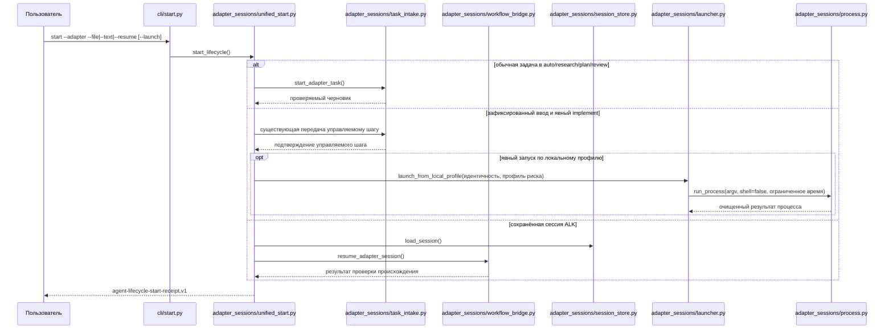

Фасад выбирает существующий примитив и не владеет переходами рабочего цикла.
Обычные режимы задачи не могут вызвать управляемое выполнение или запуск
внешнего инструмента. Передача зафиксированного входа требует явного режима
`implement` и полной привязки. Возобновление принимает только сохранённую
сессию ALK, проверяет адаптер и происхождение состояния и не трактует значение
как идентификатор диалога внешнего инструмента. Локальный процесс доступен
только при дополнительном явном указании `--launch --host-launch-profile` после
проверки файла блокировки, происхождения и профиля риска. Общий запуск через
дескриптор и запуск интерактивной сессии остаются заблокированными.

### Приём обычной задачи или Markdown

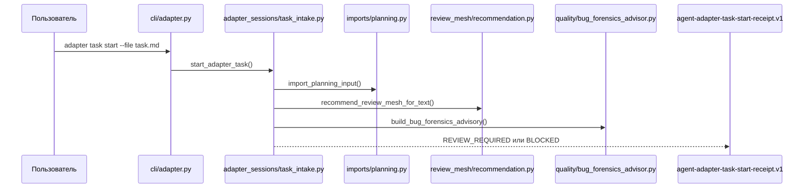

Этот маршрут используется для обычного текста задачи, Markdown, пакетов
проверки кода и импортированного планирования. Он не запускает реализацию.
Подтверждение хранит метку источника, отпечаток и размер в байтах, но не
исходный текст. Рекомендации групповой проверки и расследования ошибок остаются
подсказками, пока проверенный и зафиксированный план не включит обязательные
контрольные точки.

### Управляемый запуск адаптера

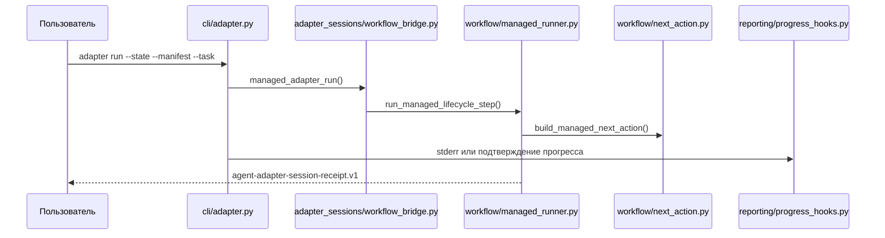

Маршрут вызывается только при наличии зафиксированного плана и привязки к
состоянию рабочего цикла. ALK возвращает следующий шаг жизненного цикла, но не
становится средой выполнения модели.

### Изменение состояния рабочего цикла

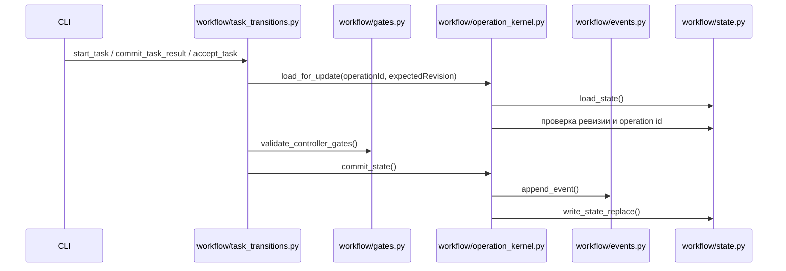

Паттерны: конечный автомат, ядро операции, оптимистичная проверка ревизии,
ключ идемпотентности и добавляемый журнал событий. Команды, меняющие состояние,
отказывают при устаревшей ревизии, повторном operation id и отсутствии
обязательных подтверждений.

### Проверка изменений GitHub или GitLab

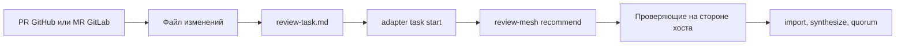

Маршрут используется, когда оператору нужна структурированная проверка
локальной ветки, запроса на слияние в GitHub или запроса на слияние в GitLab.
Работа с Git остаётся вне ALK; ALK получает стабильный пакет проверки.

### Дополнительная групповая проверка

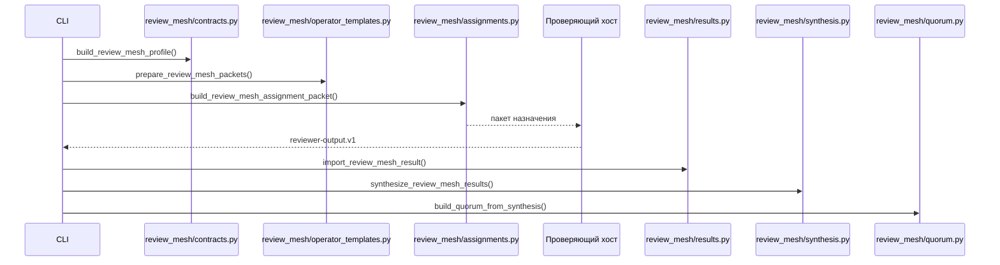

Маршрут используется для проверки черновика ведущего, параллельного
исследования или группы аудиторов реализации. Ядро не запускает проверяющих.
Кворум блокирует этап только тогда, когда зафиксированный план явно включил это
требование.

### Аудит реализации

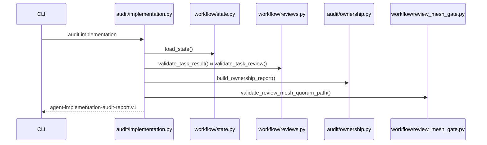

Маршрут вызывается после попытки реализации, когда уже есть результат задачи и
независимая проверка. Он проверяет происхождение, владение файлами,
подтверждения, покрытие критериев приёмки, песочницу и необязательный кворум
групповой проверки.

### Прогресс и отчёты без записи

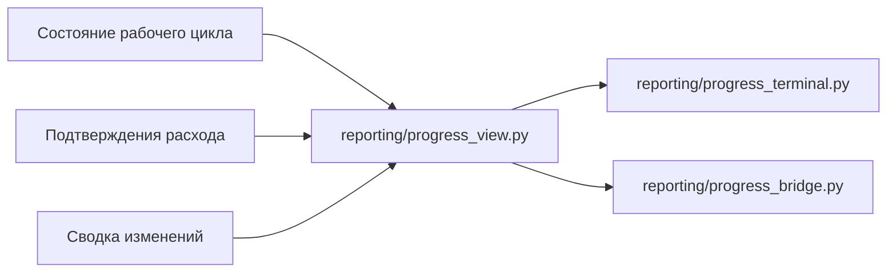

Маршрут вызывается командами `report progress`, `report progress-bridge` и
хуками прогресса у управляемых команд рабочего цикла. Отчёты не меняют
состояние, не запускают модель и не разбирают хостовую телеметрию в ядре.

### Проверка нейтральности выпуска

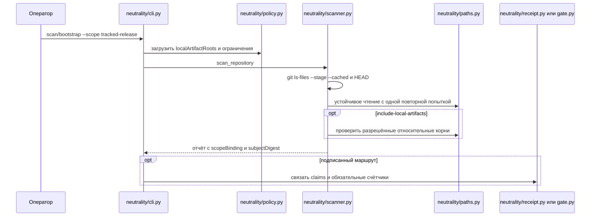

Релизные процессы используют `tracked-release` без локальных материалов.
Отдельный шаг с подтверждениями может явно включить корни, объявленные в
политике. Старые области сохраняют прежний обход, но получают подписанную
отметку об устаревании.

## Варианты работы и маршрутизация вызовов

| Вариант | Команда оператора | Основные модули | Результат |
| --- | --- | --- | --- |
| Проверка готовности | `diagnose --no-install-plans` | `diagnostics/readiness.py`, `host_protocol/*`, `context/*` | Очищенный отчёт готовности. |
| Проверка адаптера | `adapter validate/inspect/install-plan` | `cli/adapter.py`, `host_protocol/*`, `diagnostics/readiness.py` | Проверка, безопасный осмотр или пробный план установки. |
| Приём обычной задачи | `adapter task start --file/--text` | `adapter_sessions/task_intake.py`, `imports/planning.py`, `review_mesh/recommendation.py`, `quality/bug_forensics_advisor.py` | Черновое подтверждение, требующее проверки. |
| Проверка плана | `plan check`, `plan completeness-check`, `plan acceptance-check` | `planning/*`, `freeze/locks.py` | PASS/FAIL подтверждение плана. |
| Управляемый следующий шаг | `workflow run` или `adapter run` | `workflow/managed_runner.py`, `workflow/next_action.py`, `adapter_sessions/workflow_bridge.py` | Подтверждение следующего шага без запуска хоста. |
| Изменение задачи | `workflow task-start/task-result/task-accept` | `workflow/task_transitions.py`, `workflow/operation_kernel.py`, `workflow/gates.py` | Обновлённое состояние и журнал событий. |
| Аудит реализации | `audit implementation` | `audit/implementation.py`, `audit/ownership.py`, `workflow/reviews.py` | Отчёт аудита реализации. |
| Групповая проверка | `review-mesh profile/recommend/prepare/assign/import-result/synthesize/quorum` | `review_mesh/*`, `model_routing/profiles.py`, `quality/cross_check.py` | Рекомендация, подготовленные пакеты проверяющих, назначения, результаты, объединение выводов и кворум. |
| Проверка кода | Git/CLI хоста и `adapter task start` | Git вне ALK, затем `adapter_sessions/task_intake.py` и при необходимости `review_mesh/*` | Приём пакета проверки и необязательный кворум. |
| Исправление дефекта | `adapter task start` и контрольные точки зафиксированного плана | `adapter_sessions/task_intake.py`, `quality/bug_forensics_advisor.py`, `quality/bug_forensics.py`, `audit/bug_forensics.py`, `workflow/bug_forensics_gates.py` | Рекомендация профиля дефекта, затем обязательные подтверждения по плану. |
| Внешний контекст | `context external-import` и поиск по эпизодам | `context/external_memory.py`, `evidence_index/external_context.py`, `evidence_index/episode_index.py` | Необязательные подсказки контекста без права заменять доказательства. |
| Статус цели | `goal view` | `goal/view.py`, `reporting/progress_view.py`, `workflow/query.py` | Представление цели и прогресса без записи. |
| Отображение прогресса | `report progress`, `report progress-bridge`, хуки прогресса | `reporting/*`, `cli/progress_hooks.py` | Текстовый или JSON-прогресс без вызова модели. |
| Проверка релиза | Релизные инструменты и тесты | `tools/release/*`, `contracts/release_contract_schemas.py`, docs/tests | Проверка исходного релиза и подтверждений. |

## Используемые паттерны

| Паттерн | Где используется | Зачем нужен |
| --- | --- | --- |
| Порты и адаптеры | `adapters/*`, `host_protocol/*`, `adapter_sessions/*` | Держать команды хоста, секреты и возможности вне ядра жизненного цикла. |
| Контракты сначала | `contracts/*`, `schemas.py`, публичные `.v1` подтверждения | Делать каждое заявление жизненного цикла машинно проверяемым и переносимым. |
| Диспетчер команд | `cli/main.py`, `cli/parsers.py`, `cli/dispatch.py`, `cli/dispatch_*.py` | Оставлять корневой CLI тонким и направлять каждую группу команд в её доменный обработчик. |
| Функциональное ядро и императивная оболочка | Функции создания и проверки возвращают словари; CLI работает с путями и выводом. | Упростить тестирование и чтение небольшими моделями. |
| Конечный автомат | `workflow/state.py`, `workflow/task_transitions.py`, `runner/core.py` | Сделать фазы жизненного цикла явными и отказывать при недопустимых переходах. |
| Ядро операции | `workflow/operation_kernel.py` | Централизовать проверку ревизии, идемпотентность и запись состояния/событий. |
| Цепочка контрольных точек | `workflow/gates.py`, контрольные точки аудита, завершения и кворума | Не принимать работу и не финализировать запуск без обязательных подтверждений. |
| Стратегия и политика | `policy/*`, `model_routing/*`, `metrics/recommendations.py` | Выбирать безопасный маршрут жизненного цикла и класс модели без привязки к провайдеру. |
| Фасад | `audit/implementation.py`, `diagnostics/bundles.py`, `reporting/*` | Собрать несколько проверок в один типизированный отчёт без дублирования нижних уровней. |
| Пара создания и проверки | Большинство контрактных модулей и релизных валидаторов | Детерминированно создать подтверждение и независимо его проверить. |
| Отказ при сомнении | Импорт, запуск адаптера, импорт результата проверки, релизные контрольные точки | Отказывать при небезопасном или неподтверждённом пути вместо догадок. |

## Архитектурные правила

- Смысл жизненного цикла находится в доменных пакетах, а не в адаптерах или
  отображении CLI.
- Адаптеры описывают возможности хоста и локальные границы запуска, но не
  владеют правдой рабочего цикла.
- Сырой вход никогда не является полномочием на выполнение.
- Рекомендация не является контрольной точкой. Контрольная точка появляется
  только после явного включения в зафиксированном плане.
- Представления без записи не меняют состояние и не запускают модель.
- Расход и прогресс используют токены и ресурсы; денежная стоимость
  необязательна и принимается только если её сообщает тарифицируемый хост.
- Публичные заявления релиза должны опираться на отслеживаемые резюме и, когда
  нужно, на локальные очищенные подтверждения реального хоста.

## Связанные документы

- [Источник правды](../reference/source-of-truth.md)
- [Управляемые сессии адаптеров](../reference/managed-adapter-sessions.md)
- [Аудит реализации](../reference/implementation-audit.md)
- [Практические сценарии групповой проверки](../review-mesh-workflow.md)
- [Сценарии проверки кода](../code-review-workflows.md)
- [Внешний контекст памяти](../reference/external-memory.md)
- [Непрерывность цели](../reference/goal-continuity.md)
- [Профиль расследования ошибок](../reference/bug-forensics.md)
- [Проверка нейтральности](../reference/neutrality.md)

Дополнительные англоязычные архитектурные документы: `docs/architecture/release-architecture.md`,
`docs/architecture/runner-transition-contract.md` и
`docs/architecture/runner-extension-map.md`.
